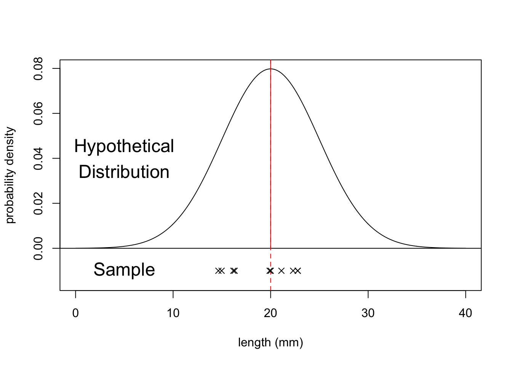

# (PART) CoreStats 1 (Practicals) {.unnumbered}

# Introduction

## One-sample tests {#cs1-one-sample-tests}

### Objectives (one-sample)
:::objectives
**Questions**

- When do I perform a one-sample test?
- Which one-sample tests are there and what are the assumptions?
- How do I interpret and present the results of the tests?

**Objectives**

- Set out your hypothesis for single sample continuous data
- Be able to summarise and visualise the data in R
- Understand and assess the underlying assumptions of the tests
- Perform a one-sample t-test and Wilcoxon signed-rank test in R
- Know which test is appropriate when
- Be able to interpret and report the results
:::

### Purpose and aim
These tests are used when we have a single sample of continuous data. It is used to find out if the sample came from a parent distribution with a given mean (or median). This essentially boils down to finding out if the sample mean (or median) is "close enough" to our hypothesised parent population mean (or median).
So, in the figure below, we could use these tests to see what the probability is that the sample of ten points comes from the distribution plotted above it i.e. a population with a mean of 20 mm.



### Choosing a test
There are two tests that we are going to look at in this situation; the one-sample t-test, and the one-sample Wilcoxon signed rank test. Both tests work on the sort of data that we’re considering here, but they both have different assumptions.

If your data is normally distributed, then a one-sample t-test is appropriate. If your data aren’t normally distributed, but their distribution is symmetric, and the sample size is small then a one-sample Wilcoxon signed rank test is more appropriate.

For each statistical test we consider there will be five tasks. These will come back again and again, so pay extra close attention.

:::highlight
1. Setting out of the hypothesis
2. Summarise and visualisation of the data
3. Assessment of assumptions
4. Implementation of the statistical test
5. Interpreting the output and presentation of results
:::

We won’t always carry these out in exactly the same order, but we will always consider each of the five tasks for every test.

## Two-sample tests {#cs1-two-sample}

### Objectives (two-sample)
:::objectives
**Questions**

- When do I perform a two-sample test?
- Which two-sample tests are there and what are the assumptions?
- How do I interpret and present the results of the tests?

**Objectives**

- Set out your hypothesis for two-sample continuous data
- Determine the correct data format to perform a two-sample test in R
- Summarise and visualise the data
- Check underlying assumptions (normality, homogeneity of variance)
- Be able to choose an appropriate two-sample test and run it in R
- Be able to interpret and report the results
:::

### Purpose and aim
These tests are used when we have two samples of continuous data where we are trying to find out if the samples came from the same parent distribution or not. This essentially boils down to finding out if there is a difference in the means of the two samples.

### Choosing a test {#two-sample-choosing-a-test}
There are five key tests that can be used to deal with two samples. Choosing which test to use depends upon which key assumptions are satisfied by your sample data and this effectively boils down to answering four questions about your samples:

1.	Are the samples normally distributed? (Yes/No)
2.	How big are your samples? (<30 data points or >30 data points)
3.	Are the samples paired? (Yes/No)
4.	Do the samples have the same variance? (Yes/No)

There are two sets of tests to consider depending on your answers to questions 1 and 2. If your data are normally distributed or if you have big samples then you need to look at the parametric tests. If your data are not normally distributed _and_ your sample size is small, then you need to look at non-parametric tests (see Figure \@ref(fig:fig-cs1-diagram-test). Questions 3 and 4 then help you pick the specific test to use, which is summarised in Figure \@ref(fig:fig-cs1-diagram-which-test).


<div class="figure" style="text-align: center">

<p class="caption">(\#fig:fig-cs1-diagram-test)Category of test</p>
</div>


<div class="figure" style="text-align: center">

<p class="caption">(\#fig:fig-cs1-diagram-which-test)Which test to use</p>
</div>

1.	Testing whether a sample comes from a normal distribution was covered in [One-sample tests](#cs1-one-sample-tests). You need to visualise your data and/or use the Shapiro-Wilk test.
2.	The size of the sample makes things easier. Because of maths (specifically due to something called the central limit theorem which I am not even going to attempt to touch upon here) if you have large samples then you can use the tests that assume normality of the parent population (Student’s t-test, Welch’s t-test and the paired t-test) even if your parent populations are certainly not normal. If you really want to understand exactly why this works, then you will have to do some more rigorous mathematics. So, for the moment I’m going to say that it’s OK to take these facts on faith and just trust me on this.
3.	Paired samples mean that for every data point in one sample there is a matching data point in the other sample that is linked to it in some inextricable way. A typical example would involve a group of 20 test subjects being measured before and after some experiment. Providing that the experiment didn’t do anything fatal to the test subjects then the data would consist of two samples; 20 pre-experiment measurements and 20 post-experiment measurements. However, because the same test subjects were used then each pre-experiment data point can be matched exactly to one of the post-experiment data points. In this sense the two samples are said to be “paired”.
4.	There are a couple of tests (Bartlett’s test and Levene’s test) that can be used to see if two samples come from distributions with the same variance. These will be covered in a later section.
5.	Resampling techniques aren’t covered in this course and require a mixture of statistical understanding and programming skill. Ask a demonstrator (or Google it 😉) if you want to know more.

## Tidy data {#cs1-tidy-data}
For two samples the data can be stored in one of three formats in R:

1.	as two separate vectors,
2.	in a stacked data frame,
3.	or in an unstacked data frame/list.

Two separate vectors case is (hopefully) obvious.

When using a data frame we have different options to organise our data. The best way of formatting data in R is by using [the tidy data format](https://r4ds.had.co.nz/tidy-data.html).

:::highlight
**Tidy data** has the following properties:

- Each variable has its own column
- Each observation has its own row
- Each value has its own cell
:::

Stacked form (or [long format data](https://tidyr.tidyverse.org/reference/pivot_longer.html)) is where the data is arranged in such a way that each variable (thing that we measured) has its own column. If we consider a dataset containing meerkat weights (in g) from two different countries then a stacked format of the data would look like:


```
## # A tibble: 6 × 2
##   country  weight
##   <chr>     <dbl>
## 1 Botswana    514
## 2 Botswana    568
## 3 Botswana    519
## 4 Uganda      624
## 5 Uganda      662
## 6 Uganda      633
```

In the unstacked (or [wide format](https://tidyr.tidyverse.org/reference/pivot_wider.html)) form a variable (measured thing) is present in more than one column. For example, let's say we measured meerkat weight in two countries over a period of years. We could then organise our data in such a way that for each year the measured values are split by country:


```
## # A tibble: 3 × 3
##    year Botswana Uganda
##   <dbl>    <dbl>  <dbl>
## 1  1990      514    624
## 2  1992      568    662
## 3  1995      519    633
```

Having tidy data is the easiest way of doing analyses in R and I would strongly encourage you all to start adopting this format as standard for data collection and processing.
