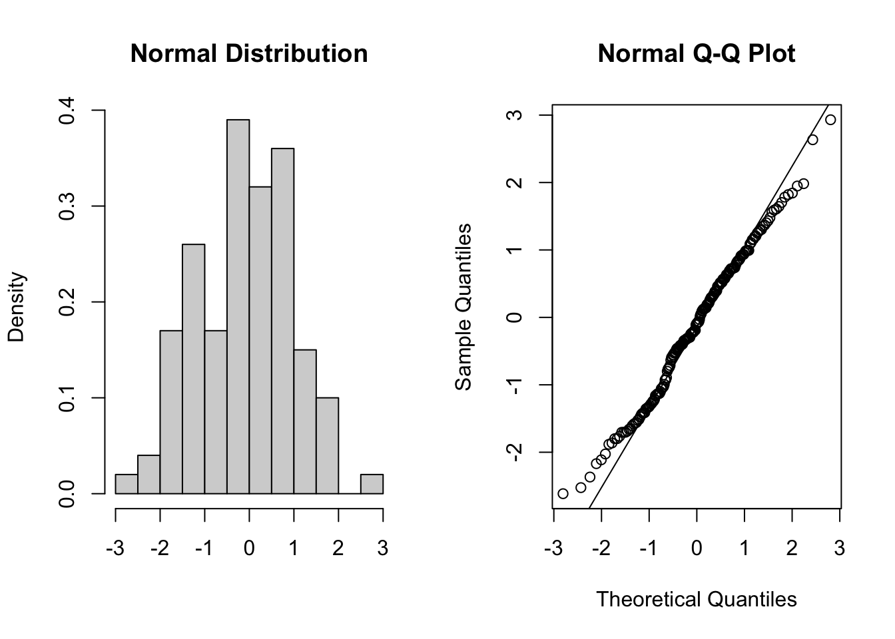
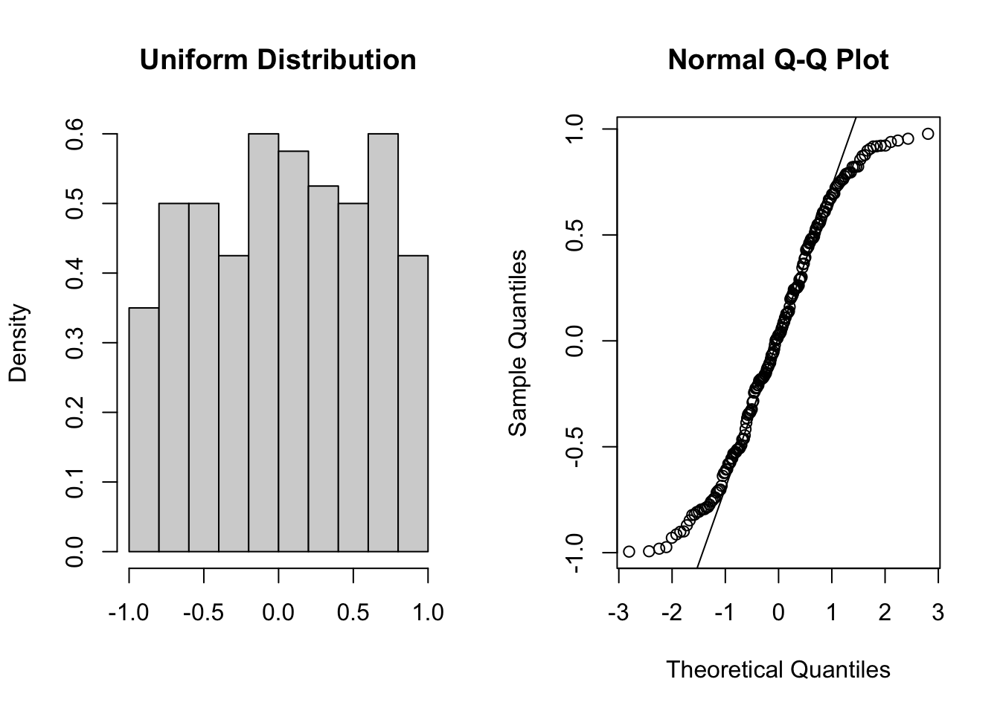
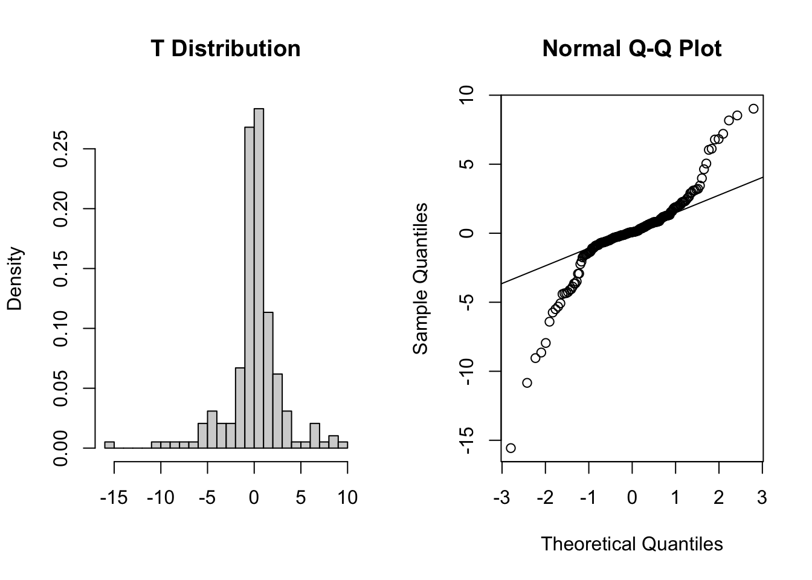
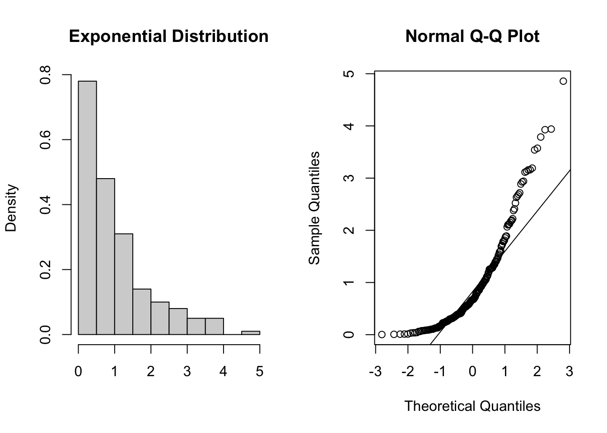

# One-sample t-test {#cs1-one-sample-t-test}

## Section commands
New commands used in this section:

| Function| Description|
|:- |:- |
|`t_test()`| Performs a one-sample t-test, Student's t-test and Welch's t-test in later sections.|
|`stat_qq()`| Plots a Q-Q plot for comparison with a normal distribution.|
|`stat_qqline()`| Adds a comparison line to the Q-Q plot.|
|`shapiro_test()`| Performs a Shapiro-Wilk test for normality.|

## Data and hypotheses
For example, suppose we measure the body lengths of male guppies (in mm) collected from the Guanapo River in Trinidad. We want to test whether the data support the hypothesis that the mean body is actually 20 mm. We form the following null and alternative hypotheses:

-	$H_0$: The mean body length is equal to 20mm ($\mu =$ 20).
-	$H_1$: The mean body length is not equal to 20mm ($\mu \neq$ 20).

We will use a one-sample, two-tailed t-test to see if we should reject the null hypothesis or not.

-	We use a **one-sample** test because we only have one sample.
-	We use a **two-tailed** t-test because we want to know if our data suggest that the true (population) mean is different from 20 mm in either direction rather than just to see if it is greater than or less than 20 mm (in which case we would use a one-tailed test).
-	We’re using a **t-test** because we don’t know any better yet and because I’m telling you to. We’ll look at what the precise assumptions/requirements need to be in a moment.

Make sure you have downloaded the data (see: [Datasets](#index-datasets)) and placed it in the `data/raw` folder within your working directory.

First we load the relevant libraries:


```r
# load tidyverse
library(tidyverse)

# load rstatix, a tidyverse-friendly stats package
library(rstatix)
```

We then read in the data and create a vector containing the data.


```r
# import the data
fishlengthDF <- read_csv("data/tidy/CS1-onesample.csv")

fishlengthDF
```

```
## # A tibble: 29 × 3
##       id river   length
##    <dbl> <chr>    <dbl>
##  1     1 Guanapo   19.1
##  2     2 Guanapo   23.3
##  3     3 Guanapo   18.2
##  4     4 Guanapo   16.4
##  5     5 Guanapo   19.7
##  6     6 Guanapo   16.6
##  7     7 Guanapo   17.5
##  8     8 Guanapo   19.9
##  9     9 Guanapo   19.1
## 10    10 Guanapo   18.8
## # … with 19 more rows
```

The first line reads the data into R and creates an object called a **tibble**, which is a type of **data frame**. This data frame contains 3 columns: a unique `id`, `river` encoding the river and `length` with the measured guppy length.

## Summarise and visualise
Summarise the data and visualise it:


```r
summary(fishlengthDF)
```

```
##        id        river               length    
##  Min.   : 1   Length:29          Min.   :11.2  
##  1st Qu.: 8   Class :character   1st Qu.:17.5  
##  Median :15   Mode  :character   Median :18.8  
##  Mean   :15                      Mean   :18.3  
##  3rd Qu.:22                      3rd Qu.:19.7  
##  Max.   :29                      Max.   :23.3
```

```r
fishlengthDF %>% 
  ggplot(aes(x = river, y = length)) +
  geom_boxplot()
```


The data do not appear to contain any obvious errors, and whilst both the mean and median are less than 20 (18.3 and 18.8 respectively) it is not absolutely certain that the sample mean is sufficiently different from this value to be "statistically significant", although we may anticipate such a result.

## Assumptions
When it comes to one-sample tests, we have two options:

a. t-test
b. Wilcoxon signed-rank test

For us to use a t-test for this analysis (and for the results to be valid) we have to make two assumptions:

1.	The parent distribution from which the sample is taken is normally distributed (and as such the sample data are normally distributed themselves).

:::note
It is worth noting though that the t-test is actually pretty robust in situations where the sample data are not normal. For sufficiently large sample sizes (your guess is as good as mine, but conventionally this means about 30 data points), you can use a t-test without worrying about whether the underlying population is normally distributed or not.
:::
2.	Each data point in the sample is independent of the others. This is in general not something that can be tested for and instead has to be considered from the sampling procedure. For example, taking repeated measurements from the same individual would generate data that are not independent.

The second point we know nothing about and so we ignore it here (this is an issue that needs to be considered from the experimental design), whereas the first assumption can be checked.
There are three ways of checking for normality:

In increasing order of rigour, we have 

1.	Histogram
2.	Quantile-quantile plot
3.	Shapiro-Wilk test

### Histogram of the data
Plot a histogram of the data, which gives:


```r
fishlengthDF %>% 
  ggplot(aes(x = length)) +
  geom_histogram(bins = 15)
```


The distribution appears to be uni-modal and symmetric, and so it isn’t obviously non-normal. However, there are a lot of distributions that have these simple properties but which aren’t normal, so this isn’t exactly rigorous. Thankfully there are other, more rigorous tests.

NB. By even looking at this distribution to assess the assumption of normality we are already going far beyond what anyone else ever does. Nevertheless, we will continue.

### Q-Q plot of the data
Q-Q plot is the short for quantile-quantile plot. This **diagnostic** plot (as it is sometimes called) is a way of comparing two distributions. How Q-Q plots work won’t be explained here but ask a demonstrator if you really want to know what is going on.

Construct a Q-Q Plot of the quantiles of the data against the quantiles of a normal distribution:


```r
# pipe the data to ggplot()
# then construct a Q-Q plot
fishlengthDF %>%
  ggplot(aes(sample = length)) +
  stat_qq() +
  stat_qq_line(colour = "red")
```


What is important to know is that if the data were normally distributed then all of the points should lie on (or close to) the diagonal line in this graph.

In this case, the points lie quite close to the line for the most part but the sample quantiles (points) from either end of the sample distribution are either smaller (below the line on the left) or larger (above the line on the right) than expected if they were supposed to be normally distributed. This suggests that the sample distribution is a bit more spread out than would be expected if it came from a normal distribution.

It is important to recognise that there isn’t a simple unambiguous answer when interpreting these types of graph, in terms of whether the assumption of normality has been well met or not and instead it often boils down to a matter of experience.

It is a very rare situation indeed where the assumptions necessary for a test will be met unequivocally and a certain degree of personal interpretation is always needed. Here you have to ask yourself whether the data are normal “enough” for you to be confident in the validity of the test.

Below are four examples of QQ plots for different types of distributions:



These two graphs relate to 200 data points that have been drawn from a normal distribution. Even here you can see that the points do not all lie perfectly on the diagonal line in the QQ plot, and a certain amount of deviation at the top and bottom of the graph can happen just by chance (if I were to draw a different set of point then the graph would look slightly different).



These two graphs relate to 200 data points that have been drawn from a uniform distribution. Uniform distributions are more condensed than normal distributions, and this is reflected in the QQ plot having a very pronounced S-shaped pattern to it (this is colloquially known as **snaking**).



These two graphs relate to 200 data points that have been drawn from a t distribution. t distributions are more spread out than normal distributions, and this is reflected in the QQ plot again having a very pronounced S-shaped pattern to it, but this time the snaking is a reflection of that observed for the uniform distribution.



These two graphs relate to 200 data points that have been drawn from an exponential distribution. Exponential distributions are not symmetric and are very skewed compared with normal distributions. The significant right-skew in this distribution is reflected in the QQ plot again having points that curve away above the diagonal line at both ends (a left-skew would have the points being below the line at both ends).

In all four cases it is worth noting that the deviations are only at the ends of the plot.

### Shapiro-Wilk test
This is one of a number of formal statistical test that assess whether a given sample of numbers come from a normal distribution. It calculates the probability of getting the sample data if the underlying distribution is in fact normal. It is very easy to carry out in R.

Perform a Shapiro-Wilk test on the data:


```r
fishlengthDF %>% 
  shapiro_test(length)
```

```
## # A tibble: 1 × 3
##   variable statistic     p
##   <chr>        <dbl> <dbl>
## 1 length       0.949 0.176
```

*	`variable` indicated the variable that was used to perform the test on
* `statistic` gives the calculated W-value (0.9493842)
* `p` gives the calculated p-value (0.1764229)

As the p-value is bigger than 0.05 (say) then we can say that there is insufficient evidence to reject the null hypothesis that the sample came from a normal distribution.

It is important to recognise that the Shapiro-Wilk test is not without limitations. It is rather sensitive to the sample size being considered. In general, for small sample sizes, the test is very relaxed about normality (and nearly all datasets are considered normal), whereas for large sample sizes the test can be overly strict, and it can fail to recognise datasets that are very nearly normal indeed.

### Assumptions overview
:::highlight
In terms of assessing the assumptions of a test it is always worth considering several methods, both graphical and analytic, and not just relying on a single method.
:::

In the `fishlengthDF` example, the graphical Q-Q plot analysis was not especially conclusive as there was some suggestion of snaking in the plots, but the Shapiro-Wilk test gave a non-significant p-value (0.1764). Putting these two together, along with the original histogram and the recognition that there were only 30 data points in the dataset I personally would be happy that the assumptions of the t-test were met well enough to trust the result of the t-test, but you may not be...

In which case we would consider an alternative test that has less stringent assumptions (but is less powerful): the [one-sample Wilcoxon signed-rank test](#cs1-onesample-wilcoxon-signed-rank).


## Implement the test
Perform a one-sample, two-tailed t-test:


```r
fishlengthDF %>% 
  t_test(length ~ 1,
         mu = 20,
         alternative = "two.sided")
```

The `t_test()` function requires three arguments:

1. the `formula`, here we give it `length ~ 1` to indicate it is a one-sample test on `length`
2. the `mu` is the mean to be tested under the null hypothesis, here it is 20
3. the `alternative` argument gives the type of alternative hypothesis and must be one of `two.sided`, `greater` or `less`. We have no prior assumptions on whether the alternative fish length would be greater or less than 20, so we choose `two.sided`.

## Interpreting the output and report results
This is the output that you should now see in the console window:


```
## # A tibble: 1 × 7
##   .y.    group1 group2         n statistic    df       p
## * <chr>  <chr>  <chr>      <int>     <dbl> <dbl>   <dbl>
## 1 length 1      null model    29     -3.55    28 0.00139
```

* the `statistic` column gives us the t-statistic of -3.5492 (we’ll need this for reporting)
* the `df` column tells us there are 28 degrees of freedom (again we’ll need this for reporting)
* the `p` column gives us the p-value of 0.00139

The p-value is what we're mostly interested in. It gives the probability of us getting a sample such as ours if the null hypothesis were actually true.

So:

-	a high p-value means that there is a high probability of observing a sample such as ours and the null hypothesis is probably true whereas
-	a low p-value means that there is a low probability of observing a sample such as ours and the null hypothesis is probably not true.

It is important to realise that the p-value is just an indication and there is no absolute certainty here in this interpretation.

People, however like more definite answers and so we pick an artificial probability threshold (called a significance level) in order to be able to say something more decisive. The standard significance level is 0.05 and since our p-value is smaller than this we choose to say that "it is very unlikely that we would have this particular sample if the null hypothesis were true". Consequently, we can reject our null hypothesis and state that:

> A one-sample t-test indicated that the mean body length of male guppies ($\mu$ = 18.29mm) differs significantly from 20 mm (t = -3.55, df = 28, p = 0.0014).

The above sentence is an adequate concluding statement for this test and is what we would write in any paper or report. Note that we have included (in brackets) information on the actual mean value of our group($\mu$ = 18.29mm), the test statistic (t = -3.55), the degrees of freedom (df = 28), and the p-value (p = 0.0014). In some journals you are only required to report whether the p-value is less than the critical value (e.g. p < 0.05) but I would always recommend reporting the actual p-value obtained.

Please feel free to ask a demonstrator if any aspect of this section is unclear as this does form the core of classical hypothesis testing and the logic here applies to all of the rest of the tests.

## Exercise
:::exercise

The following data are the dissolving times (in seconds) of a drug in agitated gastric juice:

`42.7, 43.4, 44.6, 45.1, 45.6, 45.9, 46.8, 47.6`

Do these results provide any evidence to suggest that dissolving time for this drug is different from 45 seconds?

1. Create a [tidy](#cs1-tidy-data) data frame and save it in `.csv` format
2. Write down the null and alternative hypotheses.
3. Summarise and visualise the data and perform an appropriate one-sample t-test.
    - What can you say about the dissolving time? (what sentence would you use to report this)
4. Check the assumptions for the test.
    - Was the test valid?

<details><summary>Answer</summary>

### Hypotheses

$H_0$ : mean $=$ 45s

$H_1$ : mean $\neq$ 45s

### Data, summarise & visualise

We can create a data frame in Excel and save it as an `.csv` file, for example as `CS1-gastric_juices.csv`. It contains two columns, an `id` column and a `dissolving_time` column with the measured values.


```r
# load the data
dissolving <- read_csv("data/tidy/CS1-gastric_juices.csv")

# have a look at the data
dissolving
```

```
## # A tibble: 8 × 2
##      id dissolving_time
##   <dbl>           <dbl>
## 1     1            42.7
## 2     2            43.4
## 3     3            44.6
## 4     4            45.1
## 5     5            45.6
## 6     6            45.9
## 7     7            46.8
## 8     8            47.6
```

```r
# summarise the data
summary(dissolving)
```

```
##        id       dissolving_time
##  Min.   :1.00   Min.   :42.70  
##  1st Qu.:2.75   1st Qu.:44.30  
##  Median :4.50   Median :45.35  
##  Mean   :4.50   Mean   :45.21  
##  3rd Qu.:6.25   3rd Qu.:46.12  
##  Max.   :8.00   Max.   :47.60
```
We can look at the histogram and boxplot of the data:


```r
# create a histogram
dissolving %>% 
  ggplot(aes(x = dissolving_time)) +
  geom_histogram(bins = 4)
```


```r
# create a boxplot
dissolving %>% 
  ggplot(aes(y = dissolving_time)) +
  geom_boxplot()
```


There are only 8 data points, so the histogram is rather uninformative. We even had to reduce the number of bins to get any meaningful visualisation. Thankfully the boxplot is a bit more useful here. We can see:

1. There don't appear to be any major errors in data entry and there aren't any huge outliers
2. The median value in the box-plot (the thick black line) is pretty close to 45 and so I wouldn't be surprised if the mean of the data isn't significantly different from 45. We can confirm that by looking at the mean and median values that we calculated using the summary command from earlier.
3. The data appear to be symmetric, and so whilst we can't tell if they're normal they're a least not massively skewed.

### Assumptions

Normality:


```r
# perform Shapiro-Wilk test
dissolving %>% 
  shapiro_test(dissolving_time)
```

```
## # A tibble: 1 × 3
##   variable        statistic     p
##   <chr>               <dbl> <dbl>
## 1 dissolving_time     0.980 0.964
```


```r
# create a Q-Q plot
dissolving %>% 
  ggplot(aes(sample = dissolving_time)) +
  stat_qq() +
  stat_qq_line(colour = "red")
```


* The Shapiro test  has a p-value of 0.964 which (given that it is bigger than 0.05) suggests that the data are normal enough.
* The Q-Q plot isn't perfect, with some deviation of the points away from the line but since the points aren't accelerating away from the line and, since we only have 8 points, we can claim, with some slight reservations, that the assumption of normality appears to be adequately well met.

Overall, we are somewhat confident that the assumption of normality is well-enough met for the t-test to be an appropriate method for analysing the data. Note the ridiculous number of caveats here and the slightly political/slippery language I'm using. This is intentional and reflects the ambiguous nature of assumption checking. This is an important approach to doing statistics that you need to embrace.

In reality, if I found myself in this situation I would also try doing a non-parametric test on the data (Wilcoxon signed-rank test) and see whether I get the same conclusion about whether the median dissolving time differs from 45s. Technically, you don't know about the Wilcoxon test yet as you haven't done that section of the materials. Anyway, if I get the same conclusion then my confidence in the result of the test goes up considerably; it doesn't matter how well an assumption has been met, I get the same result. If on the other hand I get a completely different conclusion from carrying out the non-parametric test then all bets are off; I now have very little confidence in my test result as I don't know which one to believe (in the case that the assumptions of the test are a bit unclear). In this example a Wilcoxon test also gives us a non-significant result and so all is good.

### Implement test


```r
# perform one-sample t-test
dissolving %>% 
  t_test(dissolving_time ~ 1,
         mu = 45,
         alternative = "two.sided")
```

```
## # A tibble: 1 × 7
##   .y.             group1 group2         n statistic    df     p
## * <chr>           <chr>  <chr>      <int>     <dbl> <dbl> <dbl>
## 1 dissolving_time 1      null model     8     0.366     7 0.725
```

> A one-sample t-test indicated that the mean dissolving time of the drug is not significantly different from 45s (t=0.366 , df=7 , p=0.725)

And that, is that.
</details>
:::
