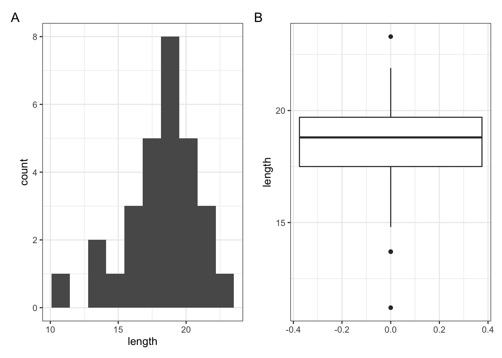

# Wilcoxon signed-rank test {#cs1-onesample-wilcoxon-signed-rank}
This test also considers a single sample, however for this test (in contrast to the one sample t-test) we don’t have to assume that the parent distribution is normally distributed. We do still need the parent distribution (and consequently the sample) to be symmetric though. In this test we look to see if the _median_ of the parent distributions differs significantly from a given hypothesised value (in contrast with the t-test that looks at the _mean_).

## Section commands
New commands used in this section:

| Function| Description|
|:- |:- |
|`wilcox_test()`| Performs one and two sample Wilcoxon tests.|

Again, we use the `fishlengthDF` dataset. The one-sample Wilcoxon signed-rank test allows to see if the _median_ body length is different from a specified value. Here we want to test whether the data support the hypothesis that the median body is actually 20 mm. The following null and alternative hypotheses are very similar to those used for the one sample t-test:

-	$H_0$: The median body length is equal to 20 mm ($\mu =$ 20).
-	$H_1$: The median body length is not equal to 20 mm ($\mu \neq$ 20).

We will use a one-sample, two-tailed Wilcoxon signed-rank test to see if we should reject the null hypothesis or not.

## Summarise and visualise
We did this before in the previous section, nothing really should have changed between now and then (if it has then you’re not off to a good start on this practical!)

## Assumptions
In order to use a one-sample Wilcoxon rank-sum test for this analysis (and for the results to be strictly valid) we have to make two assumptions:

1.	The parent distribution from which the sample is symmetric
2.	Each data point in the sample is independent of the others. This is the same as for the t-test and is a common feature of nearly all statistical tests. Lack of independence in your data is really tough to deal with (if not impossible) and a large part of proper experimental design is ensuring this.

Whilst there are formal statistical tests for symmetry we will opt for a simple visual inspection using both a boxplot and a histogram.

Plot a histogram and a boxplot of the data:


```r
# create a histogram
fishlengthDF %>% 
  ggplot(aes(x = length)) +
  geom_histogram(bins = 10)

# create boxplot
fishlengthDF %>% 
  ggplot(aes(y = length)) +
  geom_boxplot()
```

You get the following plots (we'll learn how to create panels like this later!):



Here we can see that whilst the distribution isn’t perfectly symmetric, neither is it heavily skewed to the left or right and we can make the call that the distribution is _symmetric enough_ for us to be happy with the results of the test.

## Implement the test
Perform a one-sample, two-tailed Wilcoxon signed-rank test:


```r
fishlengthDF %>% 
  wilcox_test(length ~ 1,
              mu = 20,
              alternative = "two.sided")
```

The syntax is identical to the one-sample t-test we carried out earlier.

1. the `formula`, here we give it `length ~ 1` to indicate it is a one-sample test on `length`
2. the `mu` is the median to be tested under the null hypothesis, here it is 20
3. the `alternative` argument gives the type of alternative hypothesis and must be one of `two.sided`, `greater` or `less`. We have no prior assumptions on whether the alternative median fish length would be greater or less than 20, so we choose `two.sided`.

## Interpreting the output and report results
This is the output that you should now see in the console window


```
## # A tibble: 1 × 6
##   .y.    group1 group2         n statistic       p
## * <chr>  <chr>  <chr>      <int>     <dbl>   <dbl>
## 1 length 1      null model    29      67.5 0.00122
```

* the `statistic` column gives us the t-statistic of 67.5 (we’ll need this for reporting)
* the `n` column gives us the sample size of 29
* the `p` column gives us the p-value of 0.00122

Again, the p-value is what we’re most interested in. It gives the probability of us getting a sample such as ours if the null hypothesis were actually true.
So, in this case since our p-value is less than 0.05 we can reject our null hypothesis and state that:

> A one-sample Wilcoxon signed-rank test indicated that the median body length of male guppies ($\mu$ = 18.8 mm) differs significantly from 20 mm (V = 67.5, n = 29, p = 0.0012).

The above sentence is an adequate concluding statement for this test and is what we would write in any paper or report. Note that we have included (in brackets) information on the median value of the group ($\mu$ = 18.8 mm), the test statistic (V = 67.5), the number of observations (n = 29), and the p-value (p = 0.0012).

## Exercise
:::exercise
Performing a Wilcoxon signed-rank test:

1. Analyse the drug dataset from before using a one-sample Wilcoxon signed-rank test
2. Discuss with a (virtual) neighbour which of the two tests you feel is best suited to the data.
3. Does it matter in this case?

<details><summary>Answer</summary>

### Hypotheses

$H_0$ : median $=$ 45s

$H_1$ : median $\neq$ 45s

### Assumptions

From the box-plot from the previous exercise we already know that the data are symmetric enough for the test to be valid.

### Wilcoxon signed-rank test

```r
dissolving %>% 
  wilcox_test(dissolving_time ~ 1,
              mu = 45,
              alternative = "two.sided")
```

```
## # A tibble: 1 × 6
##   .y.             group1 group2         n statistic     p
## * <chr>           <chr>  <chr>      <int>     <dbl> <dbl>
## 1 dissolving_time 1      null model     8        22 0.641
```

>A one-sample Wilcoxon-signed rank test indicated that the median dissolving time of the drug is not significantly different from 45 s (V=22, n=8 , p=0.64)

### Discussion

In terms of choosing between the two test we can see that both meet their respective assumptions and so both tests are valid. In this case both tests also agree in terms of their conclusions i.e. that the average dissolving time (either mean or median) doesn't differ significantly from the proposed value of 45 s.

* So one answer would be that it doesn't matter which test you use.
* Another answer would be that you should pick the test that measures the quantity you're interested in _i.e._ if you care about medians then use the Wilcoxon test, whereas if you care about means then use the t-test.
* A final answer would be that, since both test are valid we would prefer to use the test with greater **power**. t-tests always have more power than Wilcoxon tests (as long as they're valid) and so we could report that one. (We'll talk about this in the last session but power is effectively the capacity of a test to detect a significant difference - so more power is better).

</details>

:::

## Key points
:::keypoints
- One-sample tests are used when you have a single sample of continuous data
- We can summarise the data using the `summary()` function and visualise with `geom_boxplot()`
- The t-test assumes that the data are normally distributed and independent of each other
- The Wilcoxon signed-rank test does not assume a normal distribution, but does require independent samples
- The `t_test()` compares if the _mean_ of the parent distribution differs from a hypothesised value, whereas `wilcox_test()` compares the _median_.
- A good way of assessing assumptions is to visually check by looking at the distribution with `geom_histogram()` and quantile-quantile plots with `stat_qq()` and `stat_qqline()`
:::
