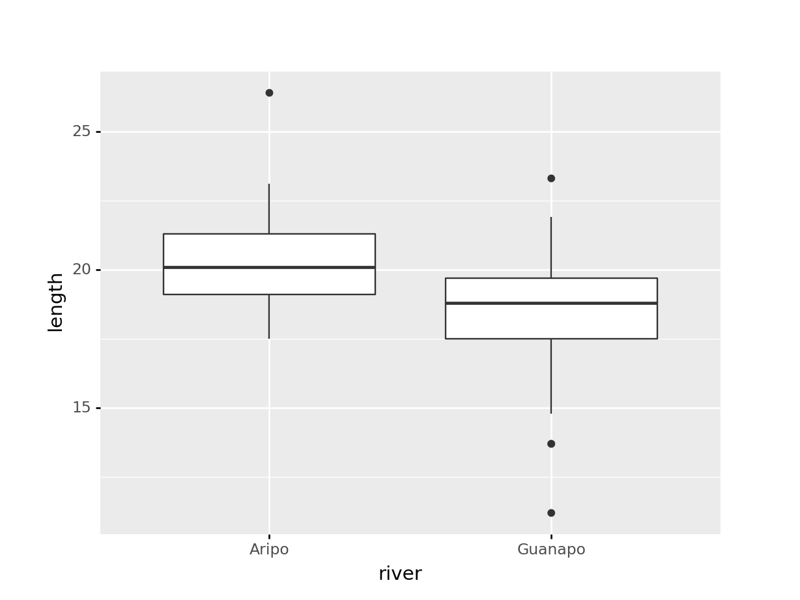
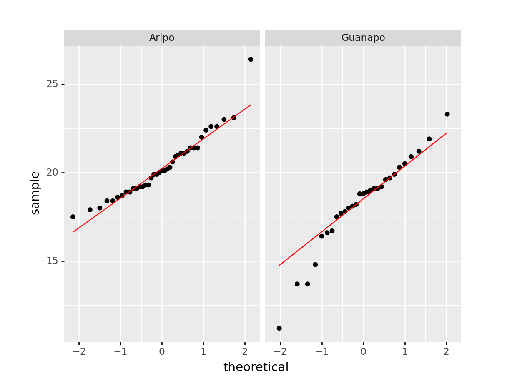

`<style>.panelset{--panel-tab-font-family: inherit;}</style>`{=html}

# Student's t-test {#cs1-students-t-test}
For this test we assume that both sample data sets are **normally distributed** and have **equal variance**. We test to see if the means of the two samples differ significantly from each other. 

:::note
The language used in this section is slightly different to that used in section \@ref(cs1-one-sample-tests). Although the language used in section \@ref(cs1-one-sample-tests) was technically more correct, the sentences are somewhat more onerous to read. Here I’ve opted for an easier reading style at the expense of technical accuracy. Please feel free to re-write this section (at your own leisure).
:::

## Libraries and functions
::::: {.panelset}

::: {.panel}
[tidyverse]{.panel-name}

| Libraries| Description|
|:- |:- |
|`library(tidyverse)`| A collection of R packages designed for data science |
|`library(rstatix)`| Converts base R stats functions to a tidyverse-friendly format. Also contains extra functionality that we'll use.|

| Functions| Description|
|:- |:- |
|`rstatix::get_summary_stats()`| Computes summary statistics |
|`rstatix::levene_test()`| Perform Levene's test for equality of variance (non-normally distributed data) |
|`bartlett.test()`| Perform Bartlett's test for equality of variance (normally distributed data) |
:::

::: {.panel}
[base R]{.panel-name}

| Libraries| Description|
|:- |:- |
|`library(car)`| Companion to Applied Regression, provides additional statistical functionality.|

| Function| Description|
|:- |:- |
|`aggregate()`| Splits the data into subsets, computes summary statistics for each, and returns the result in a convenient form |
|`unstack()`| Converts a stacked data frame into an unstacked data frame (or a list if the lengths of the samples are different) |
|`bartlett.test()`| Perform Bartlett's test for equality of variance (normally distributed data) |
|`car::leveneTest()`| Perform Levene's test for equality of variance (non-normally distributed data) |
:::

::: {.panel}
[Python]{.panel-name}

| Libraries| Description|
|:- |:- |
|`plotnine`| The Python equivalent of `ggplot2`.|
|`pandas`| A Python data analysis and manipulation tool.|
|`scipy.stats`| A Python module containing statistical functions.|

| Functions| Description|
|:- |:- |


:::
:::::

## Data and hypotheses
For example, suppose we now measure the body lengths of male guppies (in mm) collected from two rivers in Trinidad; the Aripo and the Guanapo. We want to test whether the mean body length differs between samples. We form the following null and alternative hypotheses:

-	$H_0$: The mean body length does not differ between the two groups $(\mu A = \mu G)$
-	$H_1$: The mean body length does differ between the two groups $(\mu A \neq \mu G)$

We use a two-sample, two-tailed t-test to see if we can reject the null hypothesis.

-	We use a two-sample test because we now have two samples.
-	We use a two-tailed t-test because we want to know if our data suggest that the true (population) means are different from one another rather than that one mean is specifically bigger or smaller than the other.
-	We’re using Student’s t-test because the sample sizes are big and because we’re assuming that the parent populations have equal variance (We can check this later).

The data are stored in the file `data/tidy/CS1-twosample.csv`.

Let's read in the data and have a quick look at the first rows to see how the data is structured.

::::: {.panelset}
::: {.panel}
[tidyverse]{.panel-name}


```r
rivers <- read_csv("data/tidy/CS1-twosample.csv")

rivers
```

```
## # A tibble: 68 × 3
##       id river   length
##    <dbl> <chr>    <dbl>
##  1     1 Guanapo   19.1
##  2     2 Guanapo   23.3
##  3     3 Guanapo   18.2
##  4     4 Guanapo   16.4
##  5     5 Guanapo   19.7
##  6     6 Guanapo   16.6
##  7     7 Guanapo   17.5
##  8     8 Guanapo   19.9
##  9     9 Guanapo   19.1
## 10    10 Guanapo   18.8
## # … with 58 more rows
```

:::

::: {.panel}
[base R]{.panel-name}


```r
rivers_r <- read.csv("data/tidy/CS1-twosample.csv")

head(rivers_r)
```

```
##   id   river length
## 1  1 Guanapo   19.1
## 2  2 Guanapo   23.3
## 3  3 Guanapo   18.2
## 4  4 Guanapo   16.4
## 5  5 Guanapo   19.7
## 6  6 Guanapo   16.6
```

:::

::: {.panel}
[Python]{.panel-name}


```python
rivers_py = pd.read_csv("data/tidy/CS1-twosample.csv")

rivers_py.head()
```

```
##    id    river  length
## 0   1  Guanapo    19.1
## 1   2  Guanapo    23.3
## 2   3  Guanapo    18.2
## 3   4  Guanapo    16.4
## 4   5  Guanapo    19.7
```

:::
:::::

## Summarise and visualise {#cs1-students-sumvisual}
Let's first summarise the data.

::::: {.panelset}
::: {.panel}
[tidyverse]{.panel-name}


```r
summary(rivers)
```

```
##        id           river               length     
##  Min.   : 1.00   Length:68          Min.   :11.20  
##  1st Qu.:17.75   Class :character   1st Qu.:18.40  
##  Median :34.50   Mode  :character   Median :19.30  
##  Mean   :34.50                      Mean   :19.46  
##  3rd Qu.:51.25                      3rd Qu.:20.93  
##  Max.   :68.00                      Max.   :26.40
```

This gives us the standard summary statistics, but in this case we have more than one group (Aripo and Guanapo), so it might be helpful to get summary statistics _per group_. One way of doing this is by using the `get_summary_stats()` function from the `rstatix` library.

We don't need summary statistics for the `id` column, so we un-select it. We then group the data by `river` and get the summary stats:


```r
# get common summary stats for the length column
rivers %>% 
  select(-id) %>% 
  group_by(river) %>% 
  get_summary_stats(type = "common")
```

```
## # A tibble: 2 × 11
##   river   variable     n   min   max median   iqr  mean    sd    se    ci
##   <chr>   <chr>    <dbl> <dbl> <dbl>  <dbl> <dbl> <dbl> <dbl> <dbl> <dbl>
## 1 Aripo   length      39  17.5  26.4   20.1   2.2  20.3  1.78 0.285 0.577
## 2 Guanapo length      29  11.2  23.3   18.8   2.2  18.3  2.58 0.48  0.983
```

Numbers might not always give you the best insight into your data, so we also visualise our data:


```r
rivers %>% 
  ggplot(aes(x = river, y = length)) +
  geom_boxplot()
```


:::

::: {.panel}
[base R]{.panel-name}

```r
summary(rivers)
```

```
##        id           river               length     
##  Min.   : 1.00   Length:68          Min.   :11.20  
##  1st Qu.:17.75   Class :character   1st Qu.:18.40  
##  Median :34.50   Mode  :character   Median :19.30  
##  Mean   :34.50                      Mean   :19.46  
##  3rd Qu.:51.25                      3rd Qu.:20.93  
##  Max.   :68.00                      Max.   :26.40
```

This gives us the standard summary statistics, but in this case we have more than one group (Aripo and Guanapo), so it might be helpful to get summary statistics _per group_. We can do this in base R using the `aggregate()` function.


```r
aggregate(length ~ river, data = rivers_r, summary)
```

```
##     river length.Min. length.1st Qu. length.Median length.Mean length.3rd Qu.
## 1   Aripo    17.50000       19.10000      20.10000    20.33077       21.30000
## 2 Guanapo    11.20000       17.50000      18.80000    18.29655       19.70000
##   length.Max.
## 1    26.40000
## 2    23.30000
```

* The first argument defines the variable that is being used (`length`) and grouping (`river`)
* The second argument is the data frame that is used
* The third argument defines the function that is applied across the subsets (in this case that's the `summary()` function)

Numbers might not always give you the best insight into your data, so we also visualise our data:


```r
boxplot(length ~ river,
        data = rivers_r)
```


We can use a very similar notation as we did for the summary statistics (`length ~ river`), so a box plot is created per group.
:::

::: {.panel}
[Python]{.panel-name}

```python
rivers_py.describe()
```

```
##              id     length
## count  68.00000  68.000000
## mean   34.50000  19.463235
## std    19.77372   2.370081
## min     1.00000  11.200000
## 25%    17.75000  18.400000
## 50%    34.50000  19.300000
## 75%    51.25000  20.925000
## max    68.00000  26.400000
```

This gives us the standard summary statistics, but in this case we have more than one group (Aripo and Guanapo), so it might be helpful to get summary statistics _per group_. Here we use the `pd.groupby()` function to group by `river`. We only want to have summary statistics for the `length` variable, so we specify that as well:


```python
rivers_py.groupby("river")["length"].describe()
```

```
##          count       mean       std   min   25%   50%   75%   max
## river                                                            
## Aripo     39.0  20.330769  1.780620  17.5  19.1  20.1  21.3  26.4
## Guanapo   29.0  18.296552  2.584636  11.2  17.5  18.8  19.7  23.3
```

Numbers might not always give you the best insight into your data, so we also visualise our data:


```python
(
  ggplot(rivers_py, aes(x = "river", y = "length"))
  + geom_boxplot()
)
```



:::
:::::

The box plot does appear to suggest that the two samples have different means, and moreover that the guppies in Guanapo may be smaller than the guppies in Aripo. It isn’t immediately obvious that the two populations don’t have equal variances though (box plots are not quite the right tool for this), so we plough on. Who ever said statistics would be glamorous?

## Assumptions
In order to use a Student’s t-test (and for the results to be strictly valid) we have to make three assumptions:

1.	The parent distributions from which the samples are taken are both normally distributed (which would lead to the sample data being normally distributed too).
2.	Each data point in the samples is independent of the others.
3.	The parent distributions should have the same variance.

In this example the first assumption can be ignored as the sample sizes are large enough (because of maths, with Aripo containing 39 and Guanapo 29 samples). If the samples were smaller then we would use the tests from the previous section.

The second point we can do nothing about unless we know how the data were collected, so again we ignore it.

The third point regarding equality of variance can be tested using either Bartlett’s test (if the samples are normally distributed) or Levene’s test (if the samples are not normally distributed).

This is where it gets a bit trickier. Although we don’t care if the samples are normally distributed for the t-test to be valid (because the sample size is big enough to compensate), we do need to know if they are normally distributed in order to decide which variance test to use.

So we perform a [Shapiro-Wilk test](#shapiro-wilk-test) on both samples separately.

::::: {.panelset}
::: {.panel}
[tidyverse]{.panel-name}
We can use the `group_by()` function to group the data by `river`, then we perform the Shapiro-Wilk test on the `length` measurements:


```r
# group data by river and perform test
rivers %>% 
  group_by(river) %>% 
  shapiro_test(length)
```

```
## # A tibble: 2 × 4
##   river   variable statistic      p
##   <chr>   <chr>        <dbl>  <dbl>
## 1 Aripo   length       0.936 0.0280
## 2 Guanapo length       0.949 0.176
```

:::

::: {.panel}
[base R]{.panel-name}
Before we can do that, we need to convert the data to a format where the data is split by `river`:


```r
# create a new object (a list) that contains the unstacked data
uns_rivers <- unstack(rivers_r, select = -id, form = length ~ river)
# have a look at the data
uns_rivers
```

Now that we've separated the data by river we can perform the Shapiro-Wilk test:


```r
shapiro.test(uns_rivers$Aripo)
```

```
## 
## 	Shapiro-Wilk normality test
## 
## data:  uns_rivers$Aripo
## W = 0.93596, p-value = 0.02802
```

```r
shapiro.test(uns_rivers$Guanapo)
```

```
## 
## 	Shapiro-Wilk normality test
## 
## data:  uns_rivers$Guanapo
## W = 0.94938, p-value = 0.1764
```
:::

::: {.panel}
[Python]{.panel-name}
We first need to split the data by `river`.

```python
rivers_py.groupby("river")["length"] \
.apply(lambda x: pd.Series(stats.shapiro(x), index=['W-stat','p-value'])) \
.reset_index()
```

```
##      river  level_1    length
## 0    Aripo   W-stat  0.935958
## 1    Aripo  p-value  0.028023
## 2  Guanapo   W-stat  0.949384
## 3  Guanapo  p-value  0.176420
```

The code is a bit convoluted and perhaps there is a more efficient way that I'm not aware of. Anyway, we can do this with the `groupby()` function from pandas. Next, we only select the `length` measurements and use the `.apply()` function to apply the `stats.shapiro()` test over each group. This returns two values per group: the W-statistic that the Shapiro-Wilk test uses and, the value we're most interested in, the p-value. Lastly,we use the `.reset_index()` function to repeat the grouping name.

:::
:::::
We can see that whilst the Guanapo data is probably normally distributed (p = 0.1764 > 0.05), the Aripo data is unlikely to be normally distributed (p = 0.02802 < 0.05). Remember that the p-value gives the probability of observing each sample if the parent population is actually normally distributed.

The Shapiro-Wilk test is quite sensitive to sample size. This means that if you have a large sample then even small deviations from normality will cause the sample to fail the test, whereas smaller samples are allowed to pass with much larger deviations. Here the Aripo data has nearly 40 points in it compared with the Guanapo data and so it is much easier for the Aripo sample to fail compared with the Guanapo data.

## Exercise: Q-Q plots rivers {#exercise-qq-rivers}
:::exercise ::::::

Q-Q plots for `rivers` data

Create the Q-Q plots for the two samples and discuss with your neighbour what you see in light of the results from the above Shapiro-Wilk test.

<details><summary>Answer</summary>
::::: {.panelset}
::: {.panel}
[tidyverse]{.panel-name}


```r
# we group the data by river
# then create a panel per river
# containing the Q-Q plot for that river
rivers %>% 
  ggplot(aes(sample = length)) +
  stat_qq() +
  stat_qq_line(colour = "red") +
  facet_wrap(facets = vars(river))
```


:::

::: {.panel}
[base R]{.panel-name}

```r
par(mfrow=c(1,2))
qqnorm(uns_rivers$Aripo, main = "Aripo")
qqline(uns_rivers$Aripo, col = "red")

qqnorm(uns_rivers$Guanapo, main = "Guanapo")
qqline(uns_rivers$Guanapo, col = "red")
```


:::

::: {.panel}
[Pyhon]{.panel-name}

```python
(
  ggplot(rivers_py, aes(sample = "length"))
  + stat_qq()
  + stat_qq_line(colour = "red")
  + facet_wrap("river")
)
```



:::
:::::

The Q-Q plots show the opposite of what we found with the Shapiro-Wilk tests: the data for Aripo look pretty normally distributed, whereas the assumption of normality for the Guanapo data is less certain.

What to do? Well, you could be conservative and state that you are not confident that the data in either group are normally distributed. That would be a perfectly reasonable conclusion.

I would personally not have issues with stating that the Aripo data are probably normally distributed _enough_.
</details>
::::::::::::::::::

## Equality of variance
:::highlight
Remember that statistical tests do not provide answers, they merely suggest patterns. Human interpretation is still a crucial aspect to what we do.
:::

The reason why we're checking for equality of variance (also referred to as **homogeneity of variance**) is because many statistical tests assume that the spread of the data within different parental populations (in this case, two) is the same. 

If that is indeed the case, then the data themselves should have equal spread as well.

The Shapiro-Wilk test and the Q-Q plots have shown that some of the data might not be normal _enough_ (although in opposite directions!) and so in order to test for equality of variance we will use Levene’s test.

::::: {.panelset}
::: {.panel}
[tidyverse]{.panel-name}
The function we use is `levene_test()` from the `rstatix` library.

It takes the data in the form of a formula as follows:


```r
rivers %>% 
  levene_test(length ~ river)
```

```
## # A tibble: 1 × 4
##     df1   df2 statistic     p
##   <int> <int>     <dbl> <dbl>
## 1     1    66      1.77 0.188
```

The key bit of information is the `p` column. This is the p-value (0.1876) for this test.
:::

::: {.panel}
[base R]{.panel-name}
Levene’s test is not included in the default R packages and may require the installation of an additional package called `car` (Companion to Applied Regression).

To install the `car` package, run the following command in your console:


```r
install.packages("car")
```

Alternatively, go to <kbd>Tools</kbd> > <kbd>Install packages...</kbd> > <kbd>Packages</kbd>, type in `car` and press <kbd>Install</kbd>

We can now perform Levene's test:


```r
leveneTest(length ~ river, data = rivers)
```

```
## Levene's Test for Homogeneity of Variance (center = median)
##       Df F value Pr(>F)
## group  1  1.7732 0.1876
##       66
```

Ignore any warning you might get about coercion to factors (the test needs to create grouped variables to work and R versions from 4.x onwards do not read in the data as factors).

The key bit of information is the 3rd line under the text `Pr(>F)`. This is the p-value for this test.
:::

::: {.panel}
[Python]{.panel-name}
Levene's test is included in the `stats` module in `scipy`. It requires two vectors as input, so we need to subset our data for each river:


```python
guanapo = rivers_py.query('river == "Guanapo"')["length"]
aripo = rivers_py.query('river == "Aripo"')["length"]

stats.levene(guanapo, aripo)
```

```
## LeveneResult(statistic=1.7731837331911642, pvalue=0.18756940068805075)
```

:::
:::::

The p-value tells us the probability of observing these two samples if they come from distributions with the same variance. As this probability is greater than our arbitrary significance level of 0.05 then we can be somewhat confident that the necessary assumptions for carrying out Student’s t-test on these two samples was valid. (Once again woohoo!)

### Bartlett's test
If we had wanted to carry out Bartlett’s test (i.e. if the data _had_ been sufficiently normally distributed) then the command would have been:


```r
bartlett.test(length ~ river, data = rivers)
```

```
## 
## 	Bartlett test of homogeneity of variances
## 
## data:  length by river
## Bartlett's K-squared = 4.4734, df = 1, p-value = 0.03443
```

The relevant p-value is given on the 3rd line.

:::note
Here we use `bartlett.test()` from base R. Surprisingly, the `rstatix` package does not have a built-in equivalent.

If we wanted to get the output of the Bartlett test into a tidy format, we could do the following, where we take the `rivers` data set and pipe it to the `bartlett.test()` function. Note that we need to define the data using a dot (`.`), because the first input into `bartlett.test()` is not the data. We then pipe the output to the `tidy()` function, which is part of the `broom` library, which kindly converts the output into a tidy format. Handy!


```r
# load the broom package
library(broom)

# perform Bartlett's test on the data and tidy
rivers %>% 
  bartlett.test(length ~ river,
                data = .) %>% 
  tidy()
```

```
## # A tibble: 1 × 4
##   statistic p.value parameter method                                   
##       <dbl>   <dbl>     <dbl> <chr>                                    
## 1      4.47  0.0344         1 Bartlett test of homogeneity of variances
```
:::

## Implement test
In this case we're ignoring the fact that the data are not normal enough, according to the Shapiro-Wilk test. However, because the sample sizes are pretty large and the t-test is also pretty robust in this case, we can perform a t-test. Remember, this is only allowed because the variances of the two groups (Aripo and Guanapo) are equal.

Perform a two-sample, two-tailed, t-test:


```r
# two-sample, two-tailed t-test
rivers %>% 
  t_test(length ~ river,
         alternative = "two.sided",
         var.equal = TRUE)
```

Here we do the following:

* We take the data set and pipe it to the `t_test()` function
* The `t_test()` function takes the formula in the format `variable ~ category`
* Again the alternative is `two.sided` because we have no prior knowledge about whether the alternative should be `greater` or `less`
* The last argument says whether the variance of the two samples can be assumed to be equal (Student's t-test) or unequal (Welch's t-test)

## Interpret output and report results
Let's look at the results of the t-test that we performed on the original (stacked) data frame:


```
## # A tibble: 1 × 8
##   .y.    group1 group2     n1    n2 statistic    df        p
## * <chr>  <chr>  <chr>   <int> <int>     <dbl> <dbl>    <dbl>
## 1 length Aripo  Guanapo    39    29      3.84    66 0.000275
```

*	The first 5 columns give you information on the variable (`.y.`), groups and sample size of each group
* The `statistic` column gives the t-value of 3.8433 (we need this for reporting)
* The `df` column tell us there are 66 degrees of freedom (we need this for reporting)
* The `p` column gives us a p-value of 0.0002754

Again, the p-value is what we’re most interested in. Since the p-value is very small (much smaller than the standard significance level) we choose to say "that it is very unlikely that these two samples came from the same parent distribution and as such we can reject our null hypothesis" and state that:

> A Student’s t-test indicated that the mean body length of male guppies in the Guanapo river (18.29 mm) differs significantly from the mean body length of male guppies in the Aripo river (20.33 mm) (t = 3.8433, df = 66, p = 0.0003).

Now there's a conversation starter.

## Exercise: Turtles
:::exercise
Serum cholesterol concentrations in turtles

Using the following data, test the null hypothesis that male and female turtles have the same mean serum cholesterol concentrations.

<table class="table table-striped" style="width: auto !important; margin-left: auto; margin-right: auto;">
 <thead>
  <tr>
   <th style="text-align:right;"> Male </th>
   <th style="text-align:right;"> Female </th>
  </tr>
 </thead>
<tbody>
  <tr>
   <td style="text-align:right;"> 220.1 </td>
   <td style="text-align:right;"> 223.4 </td>
  </tr>
  <tr>
   <td style="text-align:right;"> 218.6 </td>
   <td style="text-align:right;"> 221.5 </td>
  </tr>
  <tr>
   <td style="text-align:right;"> 229.6 </td>
   <td style="text-align:right;"> 230.2 </td>
  </tr>
  <tr>
   <td style="text-align:right;"> 228.8 </td>
   <td style="text-align:right;"> 224.3 </td>
  </tr>
  <tr>
   <td style="text-align:right;"> 222.0 </td>
   <td style="text-align:right;"> 223.8 </td>
  </tr>
  <tr>
   <td style="text-align:right;"> 224.1 </td>
   <td style="text-align:right;"> 230.8 </td>
  </tr>
  <tr>
   <td style="text-align:right;"> 226.5 </td>
   <td style="text-align:right;"> NA </td>
  </tr>
</tbody>
</table>

1. Create a tidy data frame and save as a `.csv` file
2. Write down the null and alternative hypotheses
3. Import the data into R
4. Summarise and visualise the data
5. Check your assumptions (normality and variance) using appropriate tests and plots
6. Perform a two-sample t-test
7. Write down a sentence that summarises the results that you have found 

<details><summary>Answer</summary>

### Data
Here the data is in a tidy format, with each variable in its own column, each row an observation (and a unique identifier for each observation).


### Hypotheses

$H_0$ : male mean $=$ female mean

$H_1$ : male mean $\neq$ female mean

### Load, summarise and visualise data

I'd always recommend storing data in tidy, stacked format (in fact I can't think of any situation where I would want to store data in an untidy, unstacked format!) So for this example I manually input the data into Excel in the following layout, saving the data as a CSV file and reading it in:


```r
# load the data
turtle <- read_csv("data/tidy/CS1-turtle.csv")

# and have a look
turtle
```

```
## # A tibble: 13 × 3
##       id serum sex   
##    <dbl> <dbl> <chr> 
##  1     1  220. Male  
##  2     2  219. Male  
##  3     3  230. Male  
##  4     4  229. Male  
##  5     5  222  Male  
##  6     6  224. Male  
##  7     7  226. Male  
##  8     8  223. Female
##  9     9  222. Female
## 10    10  230. Female
## 11    11  224. Female
## 12    12  224. Female
## 13    13  231. Female
```

Let's summarise the data (although a visualisation is probably much easier to work with):


```r
# create summary statistics for each group
turtle %>% 
  select(-id) %>% 
  group_by(sex) %>% 
  get_summary_stats(type = "common")
```

```
## # A tibble: 2 × 11
##   sex    variable     n   min   max median   iqr  mean    sd    se    ci
##   <chr>  <chr>    <dbl> <dbl> <dbl>  <dbl> <dbl> <dbl> <dbl> <dbl> <dbl>
## 1 Female serum        6  222.  231.   224.  5.22  226.  3.87  1.58  4.06
## 2 Male   serum        7  219.  230.   224.  6.6   224.  4.26  1.61  3.94
```

and visualise the data:


```r
# visualise the data
turtle %>% 
  ggplot(aes(x = sex, y = serum)) +
  geom_boxplot()
```


As always we use the plot and summary to assess three things:

1. Does it look like we've loaded the data in correctly?
    * We have two groups and the extreme values of our plots seem to match with our dataset, so I'm happy that we haven't done anything massively wrong here.
2.  Do we think that there is a difference between the two groups?
    * We need the result of the formal test to make sense given the data, so it's important to develop a sense of what we think is going to happen here. Whilst the ranges of the two groups suggests that the Female serum levels might be higher than the males when we look at things more closely we realise that isn't the case. The boxplot shows that the median values of the two groups is virtually identical and this is backed up by the summary statistics we calculated: the medians are both about 224.1, and the means are fairly close too (225.7 vs 224.2). Based on this, and the fact that there are only 13 observations in total I would be very surprised if any test came back showing that there was a difference between the groups.
3. What do we think about assumptions?
    * Normality looks a bit worrying: whilst the `Male` group appears nice and symmetric (and so might be normal), the `Female` group appears to be quite skewed (since the median is much closer to the bottom than the top). We'll have to look carefully at the more formal checks to decided whether we think the data are normal enough for us to use a t-test.
    * Homogeneity of variance. At this stage the spread of the data within each group looks similar, but because of the potential skew in the Female group we'll again want to check the assumptions carefully.


### Assumptions

**Normality**

Let's look at the normality of each of the groups separately. There are several ways of getting at the `serum` values for Males and Females separately. We'll use the unstacking method, then use Shapiro-Wilk followed by qqplots.


```r
# perform Shapiro-Wilk test on each group
turtle %>% 
  group_by(sex) %>% 
  shapiro_test(serum)
```

```
## # A tibble: 2 × 4
##   sex    variable statistic     p
##   <chr>  <chr>        <dbl> <dbl>
## 1 Female serum        0.842 0.135
## 2 Male   serum        0.944 0.674
```

The p-values for both Shapiro-Wilk tests are non-significant which suggests that the data are normal enough. This is a bit surprising given what we saw in the boxplot but there are two bits of information that we can use to reassure us.

1. The p-value for the Female group is smaller than for the Male group (suggesting that the Female group is closer to being non-normal than the Male group) which makes sense.
2. The Shapiro-Wilk test is generally quite relaxed about normality for small sample sizes (and notoriously strict for very large sample sizes). For a group with only 6 data points in it, the data would actually have to have a really, really skewed distribution. Given that the Female group only has 6 data points in it, it's not too surprising that the Shapiro-Wilk test came back saying everything is OK.


```r
# create Q-Q plots for both groups
turtle %>% 
  ggplot(aes(sample = serum)) +
  stat_qq() +
  stat_qq_line(colour = "red") +
  facet_wrap(facets = vars(sex))
```


The results from the Q-Q plots echo what we've already seen from the Shapiro-Wilk analyses. The Male group doesn't look too bad whereas the Female group looks somewhat dodgy.

Overall, the assumption of normality of the data doesn't appear to be very well met at all, but we do have to bear in mind that there are only a few data points in each group and we might just be seeing this pattern in the data due to random chance rather than because the underlying populations are actually not normally distributed. Personally, though I'd edge towards non-normal here.

**Homogeneity of Variance**

It's not clear whether the data are normal or not, so it isn't clear which test to use here. The sensible approach is to do both and hope that they agree (fingers crossed!)

Bartlett's test gives us:


```r
# perform Bartlett's test
bartlett.test(serum ~ sex,
              data = turtle)
```

```
## 
## 	Bartlett test of homogeneity of variances
## 
## data:  serum by sex
## Bartlett's K-squared = 0.045377, df = 1, p-value = 0.8313
```

and Levene's test gives us:


```r
# perform Levene's test
turtle %>% 
  levene_test(serum ~ sex)
```

```
## # A tibble: 1 × 4
##     df1   df2 statistic     p
##   <int> <int>     <dbl> <dbl>
## 1     1    11     0.243 0.631
```

The good news is that both Levene and Bartlett agree that there is homogeneity of variance between the two groups (thank goodness!).

Overall, what this means is that we're not too sure about normality, but that homogeneity of variance is pretty good.

### Implement two-sample t-test

Because of the result of the Bartlett test I know that I can carry out a two-sample Student's t-test (as opposed to a two-sample Welch's t-test, if you're confused, see Figure \@ref(fig:fig-cs1-diagram-which-test))


```r
# perform two-sample t-test
turtle %>% 
  t_test(serum ~ sex,
         alternative = "two.sided",
         var.equal = TRUE)
```

```
## # A tibble: 1 × 8
##   .y.   group1 group2    n1    n2 statistic    df     p
## * <chr> <chr>  <chr>  <int> <int>     <dbl> <dbl> <dbl>
## 1 serum Female Male       6     7     0.627    11 0.544
```

With a p-value of 0.544, this test tells me that there is insufficient evidence to suggest that the means of the two groups are different. A suitable summary sentence would be:

> A Student's two-sample t-test indicated that the mean serum cholesterol level did not differ significantly between Male and Female turtles (t = 0.627, df = 11, p = 0.544).

### Discussion

In reality, because of the ambiguous normality assumption assessment, for this dataset I would actually carry out two different tests; the two-sample t-test with equal variance and the Mann-Whitney U test. If both of them agreed then it wouldn't matter too much which one I reported (I'd personally report both with a short sentence to say that I'm doing that because it wasn't clear whether the assumption of normality had or had not been met), but it would be acceptable to report just one. 

</details>
:::
