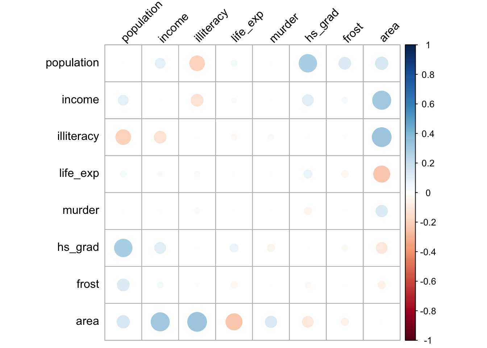

# Correlation coefficients

## Objectives
:::objectives
**Questions**

- What are correlation coefficients?
- What kind of correlation coefficients are there and when do I use them?

**Objectives**

- Be able to calculate correlation coefficients in R
- Use visual tools to explore correlations between variables
- Know the limitations of correlation coefficients
:::

## Purpose and aim
Correlation refers to the relationship of two variables (or datasets) to one another. Two datasets are said to be correlated if they are not independent from one another. Correlations can be useful because they can indicate if a predictive relationship may exist. However just because two datasets are correlated does not mean that they are causally related.

## Section commands
New commands used in this section:

| Function| Description|
|:- |:- |
|`abs()`| Computes the absolute value of a number |
|`column_to_rownames()`| Converts a column to row name |
|`cor_mat()`| Calculates a correlation matrix |
|`cor_test()`| Performs correlation test between paired samples, with a tidy output |
|`pairs()`| Plots a matrix of scatter plots |
|`slice()`| Selects rows based on their position |

## Data and hypotheses
We will use the `USArrests` dataset for this example. This rather bleak dataset contains statistics in arrests per 100,000 residents for assault, murder and robbery in each of the 50 US states in 1973, alongside the proportion of the population who lived in urban areas at that time. `USArrests` is a data frame with 50 observations of five variables: `state`, `murder`, `assault`, `urban_pop` and `robbery`.

The data are stored in the file `data/tidy/CS3-usarrests.csv`.

First we read in the data:


```r
# load the data
USArrests <- read_csv("data/tidy/CS3-usarrests.csv")

# have a look at the data
USArrests
```

```
## # A tibble: 50 × 5
##    state       murder assault urban_pop robbery
##    <chr>        <dbl>   <dbl>     <dbl>   <dbl>
##  1 Alabama       13.2     236        58    21.2
##  2 Alaska        10       263        48    44.5
##  3 Arizona        8.1     294        80    31  
##  4 Arkansas       8.8     190        50    19.5
##  5 California     9       276        91    40.6
##  6 Colorado       7.9     204        78    38.7
##  7 Connecticut    3.3     110        77    11.1
##  8 Delaware       5.9     238        72    15.8
##  9 Florida       15.4     335        80    31.9
## 10 Georgia       17.4     211        60    25.8
## # … with 40 more rows
```

## Pearson’s product moment correlation coefficient
Pearson's r (as this quantity is also known) is a measure of the linear correlation between two variables. It has a value between -1 and +1, where +1 means a perfect positive correlation, -1 means a perfect negative correlation and 0 means no correlation at all.

Before we can look at the correlations we need to reformat our data a little bit. The functions we're going to use require data frames that contain only numbers input. Because we want to keep the `state` information linked to our data, we need to define the `state` column as the name of the rows.


```r
# convert the state column to row names
USArrests %>% 
  column_to_rownames(var = "state")
```

We do not need to update our original `USArrests` data frame, so we're just piping this through and displaying the output here so you can see what's going on.

## Summarise and visualise
Knowing that the reformatting works, we can first visualise the data:


```r
# create correlation plot
USArrests %>% 
  column_to_rownames(var = "state") %>% 
  pairs(lower.panel = NULL)
```


*	The argument `lower.panel` tells R not to add the redundant reflected lower set of plots, below the diagonal

From visual inspection of the scatter plots we can see that there appears to be a slight positive correlation between all pairs of variables, although this may be very weak in some cases (`murder` and `urban_pop` for example).

## Implement test
We can calculate Pearson's correlation coefficients for each pair of the variables (e.g. the coefficient between `murder` and `assault`). There are several functions that allow you to do this. There is the `cor()` function in base R and `cor_mat()` from the `rstatix` package, that spit out the results in a matrix (grid) format. We'll use `cor_mat()` here so we can keep using our tibble data sets.


```r
# calculate Pearson's correlation coefficients
USArrests %>% 
  column_to_rownames(var = "state") %>% 
  cor_mat(method = "pearson")
```

*	First we create a matrix, keeping the `state` data linked as row names
*	The `method` argument tells R which correlation coefficient to use (`pearson` (default), `kendall`, or `spearman`)

## Interpret output and report results
This should give the following output:


```
## # A tibble: 4 × 5
##   rowname   murder assault urban_pop robbery
## * <chr>      <dbl>   <dbl>     <dbl>   <dbl>
## 1 murder      1       0.8       0.07    0.56
## 2 assault     0.8     1         0.26    0.67
## 3 urban_pop   0.07    0.26      1       0.41
## 4 robbery     0.56    0.67      0.41    1
```

The table gives the correlation coefficient between each pair of variables in the data frame. The most correlated variables are `murder` and `assault` with an `r` value of 0.80. This appears to agree well with the set of scatter plots that we produced earlier.

## Exercise: State data (Pearson)
:::exercise
Pearson's correlation for USA state data

We will use the data from the file `data/tidy/CS3-statedata.csv` dataset for this exercise. This rather more benign dataset contains information on more general properties of each US state, such as population (1975), per capita income (1974), illiteracy proportion (1970), life expectancy (1969), murder rate per 100,000 people (there's no getting away from it), percentage of the population who are high-school graduates, average number of days where the minimum temperature is below freezing between 1931 and 1960, and the state area in square miles. The dataset contains 50 rows and 8 columns, with column names: `population`, `income`, `illiteracy`, `life_exp`, `murder`, `hs_grad`, `frost` and `area`.

Load in the data (remembering to tell R that the first column of the CSV file should be used to specify the row names of the dataset) and use the `pairs()` command to visually identify 3 different pairs of variables that appear to be

1.	the most positively correlated
2.	the most negatively correlated
3.	not correlated at all

Calculate Pearson’s r for all variable pairs and see how well you were able to identify correlation visually.

<details><summary>Answer</summary>

### Read in the data


```r
USAstate <- read_csv("data/tidy/CS3-statedata.csv")

# have a look at the data
USAstate
```

```
## # A tibble: 50 × 9
##    state       population income illiteracy life_exp murder hs_grad frost   area
##    <chr>            <dbl>  <dbl>      <dbl>    <dbl>  <dbl>   <dbl> <dbl>  <dbl>
##  1 Alabama           3615   3624        2.1     69.0   15.1    41.3    20  50708
##  2 Alaska             365   6315        1.5     69.3   11.3    66.7   152 566432
##  3 Arizona           2212   4530        1.8     70.6    7.8    58.1    15 113417
##  4 Arkansas          2110   3378        1.9     70.7   10.1    39.9    65  51945
##  5 California       21198   5114        1.1     71.7   10.3    62.6    20 156361
##  6 Colorado          2541   4884        0.7     72.1    6.8    63.9   166 103766
##  7 Connecticut       3100   5348        1.1     72.5    3.1    56     139   4862
##  8 Delaware           579   4809        0.9     70.1    6.2    54.6   103   1982
##  9 Florida           8277   4815        1.3     70.7   10.7    52.6    11  54090
## 10 Georgia           4931   4091        2       68.5   13.9    40.6    60  58073
## # … with 40 more rows
```

### Pair-wise comparisons (visual)


```r
# visual comparisons of variables
USAstate %>% 
  column_to_rownames(var = "state") %>% 
  pairs(lower.panel = NULL)
```


### Calculate the correlation coefficients

To get the correlation coefficients in a format that allows us to manipulate it, we use the `cor_test()` function. This does something similar to the `cor_mat()` function - it calculates the pairwise correlation coefficients. However, it outputs the results in a table format, instead of a matrix.


```r
# calculate Pearson's correlation coefficients
USAstate %>% 
  column_to_rownames(var = "state") %>%
  cor_test(method = "pearson")
```

```
## # A tibble: 64 × 8
##    var1       var2          cor     statistic      p conf.low conf.high method 
##    <chr>      <chr>       <dbl>         <dbl>  <dbl>    <dbl>     <dbl> <chr>  
##  1 population population  1           Inf     0        1         1      Pearson
##  2 population income      0.21          1.47  0.147   -0.0744    0.460  Pearson
##  3 population illiteracy  0.11          0.750 0.457   -0.176     0.375  Pearson
##  4 population life_exp   -0.068        -0.473 0.639   -0.340     0.214  Pearson
##  5 population murder      0.34          2.54  0.0146   0.0722    0.568  Pearson
##  6 population hs_grad    -0.098        -0.686 0.496   -0.367     0.185  Pearson
##  7 population frost      -0.33         -2.44  0.0184  -0.559    -0.0593 Pearson
##  8 population area        0.023         0.156 0.877   -0.257     0.299  Pearson
##  9 income     population  0.21          1.47  0.147   -0.0744    0.460  Pearson
## 10 income     income      1     464943848.    0        1         1      Pearson
## # … with 54 more rows
```

The two variables that are compared are given in the `var1` and `var2` columns. The correlation coefficient is given in the `cor` column.

To extract the maximum, minimum and least correlated pairs, it would be easy if we filter the correlation table a bit more, because each pair now appears twice (once in each orientation, such as `murder` & `assault`, `assault` & `murder`).


```r
# calculate the correlation coefficients
# select the unique pairs
# and store in a new object
USAstate_cor <- USAstate %>% 
  column_to_rownames(var = "state") %>%
  cor_test(method = "pearson") %>% 
  # filter out the self-pairs (e.g. murder & murder)
  filter(cor != 1) %>% 
  # arrange the data by correlation coefficient
  arrange(cor) %>% 
  # each correlation appears twice
  # because the pairs are duplicated
  group_by(cor) %>% 
  # slice the first row of each group
  slice(seq(1, n(), by = 2)) %>% 
  # remove the grouping
  ungroup()

# have a look at the ouput
USAstate_cor
```

```
## # A tibble: 28 × 8
##    var1       var2         cor statistic        p conf.low conf.high method 
##    <chr>      <chr>      <dbl>     <dbl>    <dbl>    <dbl>     <dbl> <chr>  
##  1 life_exp   murder     -0.78    -8.66  2.26e-11   -0.870   -0.642  Pearson
##  2 illiteracy frost      -0.67    -6.29  9.16e- 8   -0.801   -0.484  Pearson
##  3 illiteracy hs_grad    -0.66    -6.04  2.17e- 7   -0.791   -0.464  Pearson
##  4 illiteracy life_exp   -0.59    -5.04  6.97e- 6   -0.745   -0.371  Pearson
##  5 murder     frost      -0.54    -4.43  5.4 e- 5   -0.711   -0.307  Pearson
##  6 murder     hs_grad    -0.49    -3.87  3.25e- 4   -0.675   -0.243  Pearson
##  7 income     illiteracy -0.44    -3.37  1.51e- 3   -0.638   -0.181  Pearson
##  8 population frost      -0.33    -2.44  1.84e- 2   -0.559   -0.0593 Pearson
##  9 income     murder     -0.23    -1.64  1.08e- 1   -0.478    0.0516 Pearson
## 10 life_exp   area       -0.11    -0.748 4.58e- 1   -0.374    0.176  Pearson
## # … with 18 more rows
```

Now that we have the unique pairs with their corresponding correlation coefficients, we can extract the information that we need:


```r
# get most positively correlated pair
USAstate_cor %>%
  filter(cor == max(cor))

# get most negatively correlated pair
USAstate_cor %>%
  filter(cor == min(cor))

# get least correlated pair
USAstate_cor %>%
  # abs() computes the absolute value
  filter(cor == min(abs(cor)))
```

So taken together:

1. The most **positively** correlated variables are  illiteracy and murder
2. The most **negatively** correlated variables are life_exp and murder
3. The most **uncorrelated** variables are population and area

</details>
:::

## Spearman's rank correlation coefficient
This test first calculates the rank of the numerical data (i.e. their position from smallest (or most negative) to the largest (or most positive)) in the two variables and then calculates Pearson’s product moment correlation coefficient using the ranks. As a consequence, this test is less sensitive to outliers in the distribution.

## Implement test
We are using the same `USArrests` data set as before, so run this command:


```r
USArrests %>% 
  column_to_rownames(var = "state") %>% 
  cor_mat(method = "spearman")
```

*	Remember that `cor_mat()` requires a matrix, so we use the `state` column as row names
*	The argument `method` tells R which correlation coefficient to use 

## Interpret output and report results
This gives the following output:


```
## # A tibble: 4 × 5
##   rowname   murder assault urban_pop robbery
## * <chr>      <dbl>   <dbl>     <dbl>   <dbl>
## 1 murder      1       0.82      0.11    0.68
## 2 assault     0.82    1         0.28    0.71
## 3 urban_pop   0.11    0.28      1       0.44
## 4 robbery     0.68    0.71      0.44    1
```

The table gives the correlation coefficient between each pair of variables in the data frame. Slightly annoyingly, each pair occurs twice but in opposite direction.

## Exercise: State data (Spearman)
:::exercise
Spearman's correlation for USA state data

Calculate Spearman’s correlation coefficient for the `data/tidy/CS3-statedata.csv` dataset.

Which variable’s correlations are affected most by the use of the Spearman’s rank compared with Pearson’s r?

With reference to the scatter plot produced earlier, can you explain why this might this be?

*	Remember to use `column_to_rownames(var = "state")` argument to load the data as a matrix

<details><summary>Hint</summary>

1. Instead of eye-balling differences, think about how you can determine the difference between the two correlation matrices
2. The `cor_plot()` function can be very useful to visualise matrices
</details>

<details><summary>Answer</summary>


```r
USAstate %>% 
  column_to_rownames(var = "state") %>% 
  cor_mat(method = "spearman")
```

```
## # A tibble: 8 × 9
##   rowname    population income illiteracy life_exp murder hs_grad frost   area
## * <chr>           <dbl>  <dbl>      <dbl>    <dbl>  <dbl>   <dbl> <dbl>  <dbl>
## 1 population       1     0.12        0.31    -0.1    0.35   -0.38 -0.46 -0.12 
## 2 income           0.12  1          -0.31     0.32  -0.22    0.51  0.2   0.057
## 3 illiteracy       0.31 -0.31        1       -0.56   0.67   -0.65 -0.68 -0.25 
## 4 life_exp        -0.1   0.32       -0.56     1     -0.78    0.52  0.3   0.13 
## 5 murder           0.35 -0.22        0.67    -0.78   1      -0.44 -0.54  0.11 
## 6 hs_grad         -0.38  0.51       -0.65     0.52  -0.44    1     0.4   0.44 
## 7 frost           -0.46  0.2        -0.68     0.3   -0.54    0.4   1     0.11 
## 8 area            -0.12  0.057      -0.25     0.13   0.11    0.44  0.11  1
```

In order to determine which variables are most affected by the choice of Spearman vs Pearson you could just plot both matrices out side by side and try to spot what was going on, but one of the reasons we're using R is that we can be a bit more **programmatic** about these things. Also, our eyes aren't that good at processing and parsing this sort of information display. A better way would be to somehow visualise the data.

Let's calculate the difference between the two correlation matrices. We create a correlation matrix using `cor_mat()`. Next we remove the `rowname`, so we're left with just a data frame containing numbers. That way we can subtract the values of the two data frames.

Lastly, we use the `cor_plot()` function to plot a heatmap of the differences.


```r
# create a data frame that contains all the Pearson's coefficients
USAstate_pear <- USAstate %>% 
  column_to_rownames(var = "state") %>% 
  cor_mat(method = "pearson") %>% 
  # remove the row names
  select(-rowname)

# create a data frame that contains all the Pearson's coefficients
USAstate_spear <- USAstate %>% 
  column_to_rownames(var = "state") %>% 
  cor_mat(method = "spearman") %>% 
  # remove the row names
  select(-rowname)

# calculate the difference between Pearson's and Spearman's
USAstate_diff <- USAstate_pear - USAstate_spear

# use the column names of the data set as rownames
rownames(USAstate_diff) <- names(USAstate_diff)

USAstate_diff %>%
  cor_plot()
```




:::note
This is one of those cases where using tidyverse is actually not necessarily the easiest way. We could do a similar thing using base R syntax:


```r
# read in the data with the base R read.csv function
# and assign the first column as row names
USAstate_base <- read.csv("data/tidy/CS3-statedata.csv", row.names = 1)

# calculate a correlation matrix using Pearson's
corPear <- cor(USAstate_base, method = "pearson")

# calculate a correlation matrix using Spearman
corSpea <- cor(USAstate_base, method = "spearman")

# calculate the difference between the two matrices
corDiff <- corPear - corSpea

# and plot it, like before
corDiff %>% 
  cor_plot()
```
:::

The plot itself is coloured from blue to red, indicating the biggest positive differences in correlation coefficients in blue. The biggest negative differences are coloured in red, whereas the least difference is indicated in white.

The plot is symmetric along the leading diagonal (hopefully for obvious reasons) and we can see that the majority of squares are light blue or light red in colour, which means that there isn't much difference between Spearman and Pearson for the vast majority of variables. The squares appear darkest when we look along the `area` row/column suggesting that there's a big difference in the correlation coefficients there.

We can now revisit the pairwise scatter plot from before to see if this makes sense:


```r
# visual comparisons of variables
USAstate %>% 
  column_to_rownames(var = "state") %>% 
  pairs(lower.panel = NULL)
```


What we can see clearly is that these correspond to plots with noticeable outliers. For example, Alaska is over twice as big as the next biggest state, Texas. Big outliers in the data can have a large impact on the Pearson coefficient, whereas the Spearman coefficient is more robust to the effects of outliers. We can see this in more detail if we look at the `area` vs `income` graph and coefficients. Pearson gives a value of 0.36, a slight positive correlation, whereas Spearman gives a value of 0.057, basically uncorrelated. That single outlier (Alaska) in the top-right of the scatter plot has a big effect for Pearson but is practically ignored for Spearman.

Well done, [Mr. Spearman](https://en.wikipedia.org/wiki/Charles_Spearman).

</details>
:::

## Key points

:::keypoints
- Correlation is the degree to which two variables are linearly related
- Correlation does not imply causation
- We can visualise correlations using the `pairs()` and `cor_plot()` functions
- Using the `cor_mat()` and `cor_test()` functions we can calculate correlation matrices
- Two main correlation coefficients are Pearson's r and Spearman's rank, with Spearman's rank being less sensitive to outliers
:::
