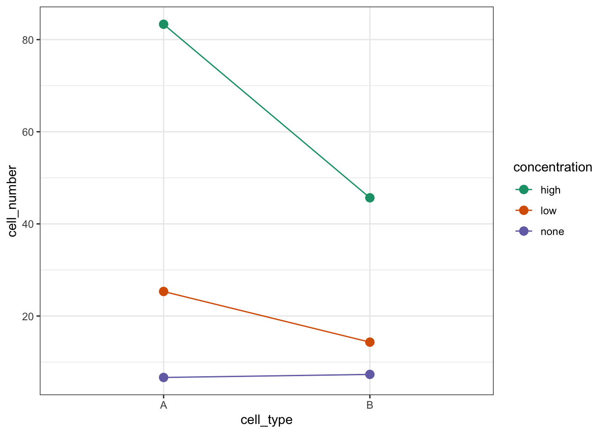

# Two-way ANOVA

## Objectives
:::objectives
**Questions**

- When is the use of a two-way ANOVA appropriate?
- How do I perform this in R?

**Objectives**

- Be able to perform a two-way ANOVA in R
- Understand the concept of interaction between two predictor variables
- Be able to plot interactions in R
:::

## Purpose and aim
A two-way analysis of variance is used when we have two categorical predictor variables (or factors) and a single continuous response variable. For example, when we are looking at how body `weight` (continuous response variable in kilograms) is affected by sex (categorical variable, `Male` or `Female`) and `exercise` type (categorical variable, `Control` or `Runner`).


When analysing these type of data there are two things we want to know:

1.	Does either of the predictor variables have an effect on the response variable i.e. does sex affect body weight? Or does being a runner affect body weight?
2.	Is there any **interaction** between the two predictor variables? An interaction would mean that the effect that exercise has on your weight depends on whether you are male or female rather than being independent of your sex. For example if being male means that runners weigh more than non-runners, but being female means that runners weight less than non-runners then we would say that there was an interaction.

We will first consider how to visualise the data before then carrying out an appropriate statistical test.


## Section commands
New commands used in this section:

| Function| Description|
|:- |:- |
|`anova()`| Carries out an ANOVA test |

## Data and hypotheses
We will recreate the example analysis used in the lecture. The data are stored as a `.csv` file called `data/tidy/CS4-exercise.csv`.

## Summarise and visualise
`exercise` is a data frame with three variables; `weight`, `sex` and `exercise.` `weight` is the continuous response variable, whereas `sex` and `exercise` are the categorical predictor variables.

First, read in the data:

```r
exercise <- read_csv("data/tidy/CS4-exercise.csv")
```

Then visualise:

```r
# visualise the data, sex vs weight
exercise %>% 
  ggplot(aes(x = sex, y = weight)) +
  geom_boxplot()
```


```r
# visualise the data, exercise vs weight
exercise %>% 
  ggplot(aes(x = exercise, y = weight)) +
  geom_boxplot()
```


These produce box plots showing the response variable (`weight`) only in terms of one of the predictor variables. The values of the other predictor variable in each case aren’t taken into account.

(Optional) Add titles, axis labels and any other information that you see fit to the plots to make them presentable.

Visualise both predictor variables together:


```r
exercise %>% 
  ggplot(aes(x = sex, y = weight, fill = exercise)) +
  geom_boxplot() +
  scale_fill_brewer(palette = "Dark2")
```


This produces box plots for all (four) combinations of the predictor variables. We are plotting `sex` on the x-axis; `weight` on the y-axis and filling the box plot by `exercise` regime.

Here I've also changed the default colouring scheme, by using `scale_fill_brewer(palette = "Dark2")`. This uses a colour-blind friendly colour palette (more about the Brewer colour pallete [here](https://ggplot2.tidyverse.org/reference/scale_brewer.html)).

(Optional) Add titles, axis labels and any other information that you see fit to the plot to make it presentable.

In this example there are only four box plots and so it is relatively easy to compare them and look for any interactions between variables, but if there were more than two groups per categorical variable, it would become harder to spot what was going on.

To compare categorical variables more easily we can just plot the group means which aids our ability to look for interactions and the main effects of each predictor variable.

Create an interaction plot:


```r
exercise %>% 
  ggplot(aes(x = sex,
             y = weight,
             colour = exercise, group = exercise)) +
  geom_point() +
  stat_summary(fun = mean, geom = "point", size = 3) +
  stat_summary(fun = mean, geom = "line") +
  scale_colour_brewer(palette = "Dark2")
```


Here we plot `weight` on the y-axis, by `sex` on the x-axis.

* we `colour` the data by `exercise` regime and `group` the data by `exercise` to work out the mean values of each group
* `geom_point()` displays the data
* `stat_summary(fun = mean)`calculates the mean for each group
* `scale_colour_brewer()` lets us define the colour palette

The choice of which categorical factor is plotted on the horizontal axis and which is plotted as different lines is completely arbitrary. Looking at the data both ways shouldn’t add anything but often you’ll find that you prefer one plot to another.

Plot the interaction plot the other way round:

```r
exercise %>% 
  ggplot(aes(x = exercise,
             y = weight,
             colour = sex, group = sex)) +
  geom_point() +
  stat_summary(fun = mean, geom = "point", size = 3) +
  stat_summary(fun = mean, geom = "line") +
  scale_colour_brewer(palette = "Dark2")
```


By now you should have a good feeling for the data and could already provide some guesses to the following three questions:

* Does there appear to be any interaction between the two categorical variables?
*	If not:
    * Does `exercise` have an effect on `weight`?
    * Does `sex` have an effect on `weight`?
    
We can now attempt to answer these three questions more formally using an ANOVA test. We have to ask R explicitly to test for three things: the interaction, the effect of `exercise` and the effect of `sex.`

## Assumptions
Before we can formally test these things we first need to define the model and check the underlying assumptions. We use the following code to define the model:


```r
# define the linear model
lm_exercise <- lm(weight ~ sex + exercise + sex:exercise,
                  data = exercise)
```

The `sex:exercise` term is how R represents the concept of an interaction between these two variables.

As the two-way ANOVA is a type of linear model we need to satisfy pretty much the same assumptions as we did for a simple linear regression or a one-way ANOVA:

1. The data must not have any systematic pattern to it
2. The residuals must be normally distributed
3. The residuals must have homogeneity of variance
4. The fit should not depend overly much on a single point (no point should have high leverage).

Again, we will check these assumptions visually by producing four key diagnostic plots.


```r
lm_exercise %>% 
  resid_panel(plots = c("resid", "qq", "ls", "cookd"),
              smoother = TRUE)
```


* The Residual plot shows the residuals against the predicted values. There is no systematic pattern here and this plot is pretty good.
*	The Q-Q plot allows a visual inspection of normality. Again, this looks OK (not perfect but OK).
*	The Location-Scale plot allows us to investigate whether there is homogeneity of variance. This plot is fine (not perfect but fine).
* The Cook's D plot shows that no individual point has a high influence on the model (all values are well below 0.5)

:::note
There is a shorthand way of writing:

`weight ~ sex + exercise + sex:exercise`

If you use the following syntax:

`weight ~ sex * exercise`

Then R interprets it exactly the same way as writing all three terms.
You can see this if you compare the output of the following two commands:


```r
anova(lm(weight ~ sex + exercise + sex:exercise,
         data = exercise))
```

```
## Analysis of Variance Table
## 
## Response: weight
##              Df Sum Sq Mean Sq F value    Pr(>F)    
## sex           1 607.20  607.20 43.1144 6.493e-06 ***
## exercise      1 184.83  184.83 13.1240  0.002287 ** 
## sex:exercise  1  82.42   82.42  5.8521  0.027839 *  
## Residuals    16 225.34   14.08                      
## ---
## Signif. codes:  0 '***' 0.001 '**' 0.01 '*' 0.05 '.' 0.1 ' ' 1
```

```r
anova(lm(weight ~ sex * exercise,
         data = exercise))
```

```
## Analysis of Variance Table
## 
## Response: weight
##              Df Sum Sq Mean Sq F value    Pr(>F)    
## sex           1 607.20  607.20 43.1144 6.493e-06 ***
## exercise      1 184.83  184.83 13.1240  0.002287 ** 
## sex:exercise  1  82.42   82.42  5.8521  0.027839 *  
## Residuals    16 225.34   14.08                      
## ---
## Signif. codes:  0 '***' 0.001 '**' 0.01 '*' 0.05 '.' 0.1 ' ' 1
```
:::

## Implement the test
The assumptions appear to be met well enough, meaning we can implement the ANOVA. We do this as follows (this is probably the easiest bit!):


```r
# perform the ANOVA
anova(lm_exercise)
```

## Interpret output and present results
Performing the ANOVA gives us the following output:


```
## Analysis of Variance Table
## 
## Response: weight
##              Df Sum Sq Mean Sq F value    Pr(>F)    
## sex           1 607.20  607.20 43.1144 6.493e-06 ***
## exercise      1 184.83  184.83 13.1240  0.002287 ** 
## sex:exercise  1  82.42   82.42  5.8521  0.027839 *  
## Residuals    16 225.34   14.08                      
## ---
## Signif. codes:  0 '***' 0.001 '**' 0.01 '*' 0.05 '.' 0.1 ' ' 1
```

We have a row in the table for each of the different effects that we’ve asked R to consider. The last column is the important one as this contains the p-values (although we will also need the F-values and the degrees of freedom for reporting purposes). We need to look at the interaction row first.

`sex:exercise` has a p-value of about 0.028 (which is smaller than 0.05) and so we can conclude that the interaction between `sex` and `exercise` is significant.

**This is where we must stop.**

The top two lines (corresponding to the effects of `sex` and `exercise`) are meaningless now and the p-values that have been reported are utterly redundant (in particular we do not in any way care that their p-values are so small).

If a model has a significant interaction then it is logically impossible to meaningfully interpret the main effects.

We would report this as follows:

> A two-way ANOVA test showed that there was a significant interaction between the effects of sex and Exercise on Weight (F = 5.8521, df = 1,16, p = 0.028). Exercise was associated with a small loss of weight in males but a larger loss of weight in females.

## Exercise: Cells
:::exercise
Cell growth

These `data/tidy/CS4-cells.csv` data are from a fictional experiment that involves looking at the effect of different concentrations of a substance on the growth rate of two different cell types (all annoyingly vague I know – suggestions for context are welcome here!). There are two cell types and three concentrations.

For each cell type we have a _control_ experiment in which no substance is added (i.e. concentration is `none`); a `low` concentration of substance and a `high` concentration of substance. The cells are called `A` and `B`.
For each combination of cell type and substance concentration we add the substance to an individual cell in a petri dish and after 8 hours, we count the number of cells in the dish (again this may well be biologically weird/impossible – suggestions are welcome). Each experiment is repeated three times.

For each cell type we have a _control_ experiment in which no substance is added (i.e. concentration is `none`); a `low` concentration of substance and a `high` concentration of substance. The cells are called `A` and `B`.
For each combination of cell type and substance concentration we add the substance to an individual cell in a petri dish and after 8 hours, we count the number of cells in the dish (Again this may well be biologically weird/impossible – suggestions are welcome). Each experiment is repeated three times.

Questions to answer:

* Visualise the data using boxplots and interaction plots.
* Does there appear to be any interaction?
* Carry out a two-way ANOVA test.
* Check the assumptions.
* What can you conclude? (Write a sentence to summarise).

<details><summary>Answer</summary>

### Load the data


```r
# read in the data
cells <- read_csv("data/tidy/CS4-cells.csv")

# let's have a peek at the data
cells
```

```
## # A tibble: 18 × 4
##       id cell_type concentration cell_number
##    <dbl> <chr>     <chr>               <dbl>
##  1     1 A         none                    7
##  2     2 A         none                    9
##  3     3 A         none                    4
##  4     4 B         none                    5
##  5     5 B         none                    8
##  6     6 B         none                    9
##  7     7 A         low                    22
##  8     8 A         low                    28
##  9     9 A         low                    26
## 10    10 B         low                    12
## 11    11 B         low                    17
## 12    12 B         low                    14
## 13    13 A         high                   89
## 14    14 A         high                   78
## 15    15 A         high                   83
## 16    16 B         high                   48
## 17    17 B         high                   44
## 18    18 B         high                   45
```

### Visualise the data


```r
cells %>% 
  ggplot(aes(x = concentration, y = cell_number)) +
  geom_boxplot()
```


```r
cells %>% 
  ggplot(aes(x = cell_type, y = cell_number)) +
  geom_boxplot()
```


Let's look at the interaction plots. We're omitting the actual data and just plotting the mean values:


```r
# by cell type
cells %>% 
  ggplot(aes(x = concentration,
             y = cell_number,
             colour = cell_type, group = cell_type)) +
  stat_summary(fun = mean, geom = "point", size = 3) +
  stat_summary(fun = mean, geom = "line") +
  scale_colour_brewer(palette = "Dark2")
```


```r
# by concentration
cells %>% 
  ggplot(aes(x = cell_type,
             y = cell_number,
             colour = concentration, group = concentration)) +
  stat_summary(fun = mean, geom = "point", size = 3) +
  stat_summary(fun = mean, geom = "line") +
  scale_colour_brewer(palette = "Dark2")
```



We're constructed both box plots and we've also constructed two interaction plots. We only needed to do one interaction plot but I find it can be quite useful to look at the data from different angles. Both interaction plots suggest that there is an interaction here as the lines in the plots aren't parallel. Looking at the interaction plot with `concentration` on the x-axis, it appears that there is non-difference between cell types when the concentration is `none`, but that there is a difference between cell types when the concentration is `low` or `high`.

### Assumptions
First we need to define the model:


```r
# define the linear model, with interaction term
lm_cells <- lm(cell_number ~ concentration * cell_type,
          data = cells)
```

Next, we check the assumptions:


```r
lm_cells %>% 
  resid_panel(plots = c("resid", "qq", "ls", "cookd"),
              smoother = TRUE)
```


So, these actually all look pretty good, although at first glance you might be a bit worried by some apparent heterogeneity of variance. The last group in the **Residual plot** does appear to be more spread out then the other 5 groups. This is echoed in the **Location-Scale plot**, where the red line kicks up at the end. Whilst this does technically signify that there is heterogeneity of variance we aren't too worried by this because there are only three data points per group. Because of this low number of data points per group when we get one data point that is a little bit more extreme than the others (purely by chance) then this has a large impact on our perception of the homogeneity of variance. If there were more data points in each group then we would be more certain that any observed heterogeneity of variance was a true feature of the underlying parent population (and therefore a problem) rather than just being caused by a single random point (and therefore not a problem).

### Implement the test
Let's carry out a two-way ANOVA:


```r
# perform the ANOVA
anova(lm_cells)
```

```
## Analysis of Variance Table
## 
## Response: cell_number
##                         Df  Sum Sq Mean Sq F value    Pr(>F)    
## concentration            2 10932.1  5466.1 537.645 1.807e-12 ***
## cell_type                1  1152.0  1152.0 113.311 1.816e-07 ***
## concentration:cell_type  2  1158.3   579.2  56.967 7.485e-07 ***
## Residuals               12   122.0    10.2                      
## ---
## Signif. codes:  0 '***' 0.001 '**' 0.01 '*' 0.05 '.' 0.1 ' ' 1
```

### Interpret the output and report the results
There is definitely a significant interaction between `concentration` and `cell_type`.

</details>
:::

## Exercise: Tulips
:::exercise
Blooms and growing conditions

The `data/tidy/CS4-tulip.csv` dataset contains information on an experiment to determine the best conditions for growing tulips (well someone has to care about these sorts of things!). The average number of flower heads (blooms) were recorded for 27 different plots. Each plot experienced one of three different watering regimes and one of three different shade regimes.

* Investigate how the number of blooms is affected by different growing conditions.


<details><summary>Answer</summary>

### Load the data
In this data set the watering regime (`water`) and shading regime (`shade`) are encoded with numerical values. However, these numbers are actually categories, representing the amount of water/shade.

As such, we don't want to treat these as numbers but as _factors_. We can convert the columns using the `as_factor()` function. Because we'd like to keep referring to these columns as factors, we will update our existing data set.


```r
# read in the data
tulip <- read_csv("data/tidy/CS4-tulip.csv")
```

```
## Rows: 27 Columns: 3
## ── Column specification ────────────────────────────────────────────────────────
## Delimiter: ","
## dbl (3): water, shade, blooms
## 
## ℹ Use `spec()` to retrieve the full column specification for this data.
## ℹ Specify the column types or set `show_col_types = FALSE` to quiet this message.
```

```r
# have a quick look at the data
tulip
```

```
## # A tibble: 27 × 3
##    water shade blooms
##    <dbl> <dbl>  <dbl>
##  1     1     1    0  
##  2     1     2    0  
##  3     1     3  111. 
##  4     2     1  183. 
##  5     2     2   59.2
##  6     2     3   76.8
##  7     3     1  225. 
##  8     3     2   83.8
##  9     3     3  135. 
## 10     1     1   80.1
## # … with 17 more rows
```

```r
# convert watering and shade regimes to factor
tulip <- tulip %>% 
  mutate(water = as_factor(water),
         shade = as_factor(shade))
```

This dataset has three variables; `blooms` (which is the response variable) and `water` and `shade` (which are the two potential predictor variables). 

### Visualise the data
As always we'll visualise the data first:


```r
# by watering regime
tulip %>% 
  ggplot(aes(x = water, y = blooms)) +
  geom_boxplot()
```


```r
# by shading regime
tulip %>% 
  ggplot(aes(x = shade, y = blooms)) +
  geom_boxplot()
```


```r
# interaction plot by watering regime
tulip %>% 
  ggplot(aes(x = shade,
             y = blooms,
             colour = water, group = water)) +
  stat_summary(fun = mean, geom = "point", size = 3) +
  stat_summary(fun = mean, geom = "line") +
  scale_colour_brewer(palette = "Dark2")
```


```r
# interaction plot by shade regime
tulip %>% 
  ggplot(aes(x = water,
             y = blooms,
             colour = shade, group = shade)) +
  stat_summary(fun = mean, geom = "point", size = 3) +
  stat_summary(fun = mean, geom = "line") +
  scale_colour_brewer(palette = "Dark2")
```


Again, both interaction plots suggest that there might be an interaction here. Digging in a little deeper from a descriptive perspective, it looks as though that `water` regime 1 is behaving differently to `water` regimes 2 and 3 under different shade conditions.

### Assumptions
First we need to define the model:


```r
# define the linear model
lm_tulip <- lm(blooms ~ water * shade,
               data = tulip)
```

Next, we check the assumptions:


```r
lm_tulip %>% 
  resid_panel(plots = c("resid", "qq", "ls", "cookd"),
              smoother = TRUE)
```


These are actually all OK. Point number 8 is messing with the homogeneity of variance assumption a little bit, but since it's only one point we won't worry about it. A two-way ANOVA analysis is still on the cards.

### Implement the test
Let's carry out the two-way ANOVA.


```r
# perform the ANOVA
anova(lm_tulip)
```

```
## Analysis of Variance Table
## 
## Response: blooms
##             Df Sum Sq Mean Sq F value    Pr(>F)    
## water        2 103626   51813 22.0542 1.442e-05 ***
## shade        2  36376   18188  7.7417   0.00375 ** 
## water:shade  4  41058   10265  4.3691   0.01211 *  
## Residuals   18  42288    2349                      
## ---
## Signif. codes:  0 '***' 0.001 '**' 0.01 '*' 0.05 '.' 0.1 ' ' 1
```

### Interpret the output and report results
So we do appear to have a significant interaction between `water` and `shade` as expected.

</details>
:::
## Key points

:::keypoints
- A two-way ANOVA is used when there are two categorical variables and a single continuous variable
- We can visually check for interactions between the categorical variables by using interaction plots
- The two-way ANOVA is a type of linear model and assumes the following:
    1. the data have no systematic pattern
    2. the residuals are normally distributed
    3. the residuals have homogeneity of variance
    4. the fit does not depend on a single point (no single point has high leverage)
:::
