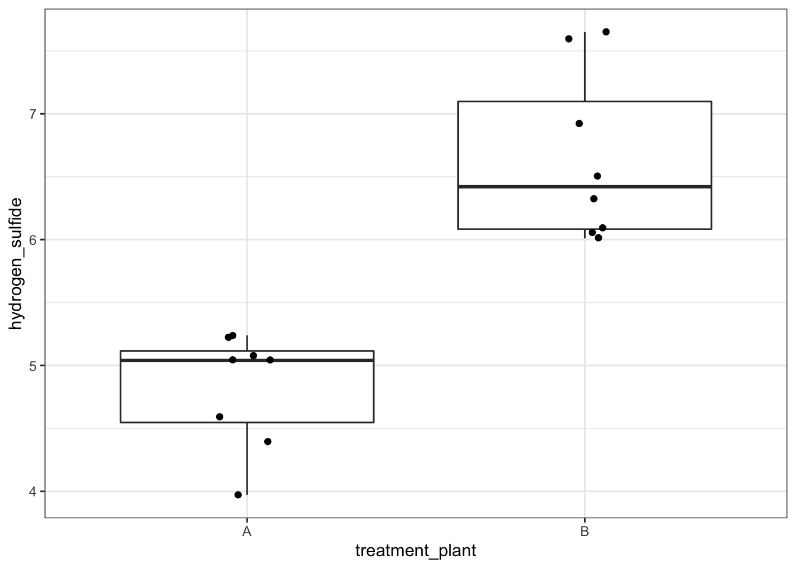
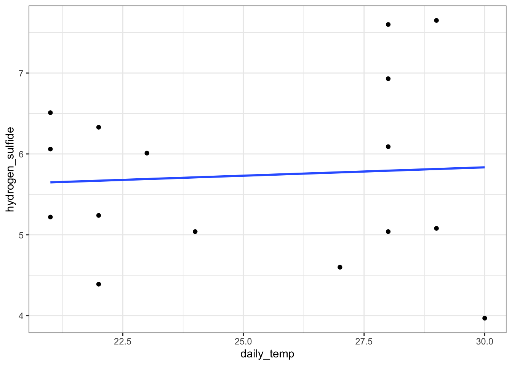
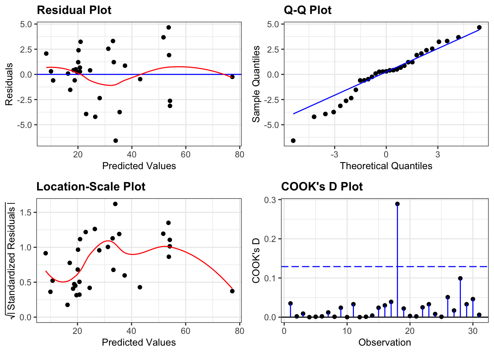

# Linear models

## Objectives
:::objectives
**Questions**

- How do I use the linear model framework with three predictor variables?

**Objectives**

- Be able to expand the linear model framework in R to three predictor variables
- Define the equation for the regression line for each categorical variable
- Be able to construct and analyse any possible combination of predictor variables in the data
:::

## Purpose and aim
Revisiting the linear model framework and expanding to systems with three predictor variables.

## Section commands
Commands used in this section

| Function| Description|
|:- |:- |
|`lm()`| Constructs a linear model according to the formula specified |

## Data and hypotheses
The first section uses the following dataset:
`data/tidy/CS5-H2S.csv`. This is a dataset comprising 16 observations of three variables (one dependent and two predictor). This records the air pollution caused by H<sub>2</sub>S produced by two types of waste treatment plants. For both types of treatment plant, we obtain eight measurements each of H<sub>2</sub>S production (ppm). We also obtain information on the daily temperature.

## Summarise and visualise
Let's first load the data:


```r
#load the data
airpoll <- read_csv("data/tidy/CS5-H2S.csv")

# look at the data
airpoll
```

```
## # A tibble: 16 × 4
##       id treatment_plant daily_temp hydrogen_sulfide
##    <dbl> <chr>                <dbl>            <dbl>
##  1     1 A                       21             5.22
##  2     2 A                       22             4.39
##  3     3 A                       22             5.24
##  4     4 A                       24             5.04
##  5     5 A                       27             4.6 
##  6     6 A                       28             5.04
##  7     7 A                       29             5.08
##  8     8 A                       30             3.97
##  9     9 B                       21             6.06
## 10    10 B                       21             6.51
## 11    11 B                       22             6.33
## 12    12 B                       23             6.01
## 13    13 B                       28             6.09
## 14    14 B                       28             6.93
## 15    15 B                       28             7.6 
## 16    16 B                       29             7.65
```

We have four columns:

1. `id` is a unique ID column
2. `treatment_plant` contains the name of the waste treatment plant
3. `daily_temp` contains the average daily temperature in degrees Celsius
4. `hydrogen_sulfide` contains H<sub>2</sub>S production (ppm)

Next, visualise the data:


```r
# plot the data
airpoll %>% 
  ggplot(aes(x = daily_temp,
             y = hydrogen_sulfide,
             colour = treatment_plant,
             group = treatment_plant)) +
  geom_point() +
  # add regression lines
  geom_smooth(method = "lm", se = FALSE) +
  scale_color_brewer(palette = "Dark2")
```


It looks as though the variable `treatment_plant` has an effect on H<sub>2</sub>S emissions (as one cloud of points is higher than the other). There is also a suggestion that the daily temperature might affect emissions (both data sets look like the gradient of the regression line through their respective cloud might not be zero) and it also appears that there might be an interaction between `treatment_plant` and `daily_temperature` because the gradient of the two regression lines is not parallel.

## Implemention
Construct and analyse a full linear model.


```r
# define the linear model with all terms and interactions
lm_full <- lm(hydrogen_sulfide ~ treatment_plant * daily_temp,
              data = airpoll)

# view the model
lm_full
```

```
## 
## Call:
## lm(formula = hydrogen_sulfide ~ treatment_plant * daily_temp, 
##     data = airpoll)
## 
## Coefficients:
##                 (Intercept)             treatment_plantB  
##                     6.20495                     -2.73075  
##                  daily_temp  treatment_plantB:daily_temp  
##                    -0.05448                      0.18141
```
So here we construct a model that has all the main effects _and_ the interaction term. Remember that `hydrogen_sulfide ~ treatment_plant * daily_temp` is a short hand version of `hydrogen_sulfide ~ treatment_plant + daily_temp + treatment_plant:daily_temp`.

This gives us the coefficients of the model:


```
## # A tibble: 4 × 2
##   term                        estimate
##   <chr>                          <dbl>
## 1 (Intercept)                   6.20  
## 2 treatment_plantB             -2.73  
## 3 daily_temp                   -0.0545
## 4 treatment_plantB:daily_temp   0.181
```

These are best interpreted by using the linear model notation:

\begin{equation}
H_2S = 6.20495 - 0.05448 \cdot daily\_temp + \\ \binom{0}{-2.73075}\binom{treatment\_plantA}{treatment\_plantB} + \\
\binom{0}{0.18141 \cdot daily\_temp}\binom{treatment\_plantA}{treatment\_plantB}
\end{equation}

This is effectively shorthand for writing down the equation of the two straight lines (one for each categorical variable):

\begin{equation}
treatment\_plantA = 6.20495 - 0.05448 \cdot daily\_temp
\end{equation}

\begin{equation}
treatment\_plantB = 3.4742 + 0.12693 \cdot daily\_temp
\end{equation}

Performing an ANOVA on the full linear model gives the following output:


```r
anova(lm_full)
```

```
## Analysis of Variance Table
## 
## Response: hydrogen_sulfide
##                            Df  Sum Sq Mean Sq F value    Pr(>F)    
## treatment_plant             1 13.3225 13.3225 54.1557 8.746e-06 ***
## daily_temp                  1  0.2316  0.2316  0.9415   0.35104    
## treatment_plant:daily_temp  1  1.4470  1.4470  5.8822   0.03201 *  
## Residuals                  12  2.9520  0.2460                      
## ---
## Signif. codes:  0 '***' 0.001 '**' 0.01 '*' 0.05 '.' 0.1 ' ' 1
```

Here we can see that the interaction term appears to be marginally significant, implying that the effect of temperature on hydrogen sulfide production is different for the two different treatment plants.

We check the assumptions of `lm_full` using the diagnostic plots:


```r
lm_full %>% 
  resid_panel(plots = c("resid", "qq", "ls", "cookd"),
              smoother = TRUE)
```


## Exploring models
Rather than stop here however, we will use the concept of the linear model to its full potential and show that we can construct and analyse any possible combination of predictor variables for this dataset. Namely we will consider the following four extra models:

| Model| Description|
|:- |:- |
|1. `hydrogen_sulfide ~ treatment_plant + daily_temp`| An additive model |
|2. `hydrogen_sulfide ~ treatment_plant` | Equivalent to a one-way ANOVA |
|3. `hydrogen_sulfide ~ daily_temp` | Equivalent to a simple linear regression |
|4. `hydrogen_sulfide ~ 1` | The null model, where we have no predictors |


### Additive model
Construct and analyse the additive linear model.


```r
# define the linear model
lm_add <- lm(hydrogen_sulfide ~ treatment_plant + daily_temp,
             data = airpoll)

# view the linear model
lm_add

# perform an ANOVA on the model
anova(lm_add)
```

* The first line creates a linear model that seeks to explain the `hydrogen_sulfide` values purely in terms of the categorical `treatment_plant` variable and the continuous `daily_temp` variable.
* The second line produces the following output:


```
## 
## Call:
## lm(formula = hydrogen_sulfide ~ treatment_plant + daily_temp, 
##     data = airpoll)
## 
## Coefficients:
##      (Intercept)  treatment_plantB        daily_temp  
##          3.90164           1.83861           0.03629
```

This gives us the coefficients of the additive model:


```
## # A tibble: 3 × 2
##   term             estimate
##   <chr>               <dbl>
## 1 (Intercept)        3.90  
## 2 treatment_plantB   1.84  
## 3 daily_temp         0.0363
```

These are best interpreted by using the linear model notation:

\begin{equation}
H_2S = 3.9 + 0.036 \cdot daily\_temp + \\
\binom{0}{1.8} \binom{treatment\_plantA}{treatment\_plantB}
\end{equation}

This is effectively shorthand for writing down the equation of the two straight lines (one for each categorical variable):

\begin{equation}
H_2S(treatment\_plantA) = 3.9 + 0.036 \cdot daily\_temp
\end{equation}

\begin{equation}
H_2S(treatment\_plantB) = 5.7 + 0.036 \cdot daily\_temp
\end{equation}

What is very important to note is not so much that the coefficients have changed (it is natural to assume that there would be some change in the model given that we’ve altered the predictor variables included). What is striking here is that the **signs** of the coefficients have changed! For example, in the full model we saw that the coefficient of `treatment_plantB` was negative (implying that in general `treatment_plantB` produced lower H<sub>2</sub>S values than `treatment_plantA` by default) whereas now it is positive indicating exactly the opposite effect. Given that the difference between the two models was the inclusion of an interaction term which we saw was significant in the analysis of the full model, it perhaps, is not surprising that dropping this term would lead to very different results.

But just imagine if we had never included it in the first place! If we only looked at the additive model we would come out with completely different conclusions about the baseline pollution levels of each plant.

* The 3rd line produces the following output:


```
## Analysis of Variance Table
## 
## Response: hydrogen_sulfide
##                 Df  Sum Sq Mean Sq F value    Pr(>F)    
## treatment_plant  1 13.3225 13.3225 39.3702 2.858e-05 ***
## daily_temp       1  0.2316  0.2316  0.6845     0.423    
## Residuals       13  4.3991  0.3384                      
## ---
## Signif. codes:  0 '***' 0.001 '**' 0.01 '*' 0.05 '.' 0.1 ' ' 1
```

Here we can see that the temperature term is not significant, whereas the `treatment_plant` term is very significant indeed.

:::exercise
Check the assumptions of this additive model. Do they differ significantly from the full model?
:::

### Revisiting ANOVA
Construct and analyse only the effect of `treatment_plant`:


```r
# visualise the data
airpoll %>% 
  ggplot(aes(x = treatment_plant, y = hydrogen_sulfide)) +
  geom_boxplot() +
  # add the data points and ensure they are jittered
  # so they do not overlap
  geom_jitter(width = 0.1)
```



```r
# define the linear model
lm_plant <- lm(hydrogen_sulfide ~ treatment_plant,
               data = airpoll)

# view the linear model
lm_plant

# perform an ANOVA on the model
anova(lm_plant)
```
* The third line gives us the model coefficients:


```
## 
## Call:
## lm(formula = hydrogen_sulfide ~ treatment_plant, data = airpoll)
## 
## Coefficients:
##      (Intercept)  treatment_plantB  
##            4.823             1.825
```

In this case it tells us the means of the groups. `(Intercept)` is the mean of the `treatment_plantA` H2S data (4.8225) whilst `treatment_plantB` tells us that the mean of the treatment plant B H2S data is 1.8250 more than the intercept value _i.e._ the mean of `treatment_plantB` is 4.8225 + 1.8250 = 6.6475.

* The last line gives us the normal ANOVA table for testing whether the means of the two groups differ significantly from each other.


```
## Analysis of Variance Table
## 
## Response: hydrogen_sulfide
##                 Df  Sum Sq Mean Sq F value    Pr(>F)    
## treatment_plant  1 13.3225 13.3225  40.278 1.809e-05 ***
## Residuals       14  4.6307  0.3308                      
## ---
## Signif. codes:  0 '***' 0.001 '**' 0.01 '*' 0.05 '.' 0.1 ' ' 1
```

:::exercise
Check the assumptions of this plant only model. Do they differ significantly from the previous models?
:::

### Revisiting regression
Construct a simple linear regression model, where H2S depends only on the average daily temperature:


```r
# plot the data
airpoll %>% 
  ggplot(aes(x = daily_temp, y = hydrogen_sulfide)) +
  geom_point() +
  geom_smooth(method = "lm", se = FALSE)
```



```r
# define the linear model
lm_temp <- lm(hydrogen_sulfide ~ daily_temp,
              data = airpoll)

# view the model
lm_temp

# perform an ANOVA on the model
anova(lm_temp)
```

* The model gives us the coefficients to the equation of the regression line


```
## 
## Call:
## lm(formula = hydrogen_sulfide ~ daily_temp, data = airpoll)
## 
## Coefficients:
## (Intercept)   daily_temp  
##     5.21465      0.02066
```

In this case it tells us the intercept `(Intercept)` and the gradient (`daily_temp`) of the regression line.

* The last line gives us the ANOVA analysis:


```
## Analysis of Variance Table
## 
## Response: hydrogen_sulfide
##            Df  Sum Sq Mean Sq F value Pr(>F)
## daily_temp  1  0.0753  0.0753   0.059 0.8117
## Residuals  14 17.8779  1.2770
```

Temperature clearly does not have a significant effect.

:::exercise
Again, check the assumptions of this temperature only model. Do they differ significantly from the previous models?
:::

### The null model
Construct and analyse the null model:


```r
# visualise the data
airpoll %>% 
  ggplot(aes(y = hydrogen_sulfide)) +
  geom_boxplot()
```


```r
# define the null model
lm_null <- lm(hydrogen_sulfide ~ 1,
              data = airpoll)

# view the model
lm_null
```

```
## 
## Call:
## lm(formula = hydrogen_sulfide ~ 1, data = airpoll)
## 
## Coefficients:
## (Intercept)  
##       5.735
```

* In `lm_null` we fit a null model to the data (effectively just finding the mean of all H<sub>2</sub>S values in the dataset)
* The null model gives us the mean of the H<sub>2</sub>S values (i.e. the coefficient of the null model)

The null model by itself is rarely analysed for its own sake but is instead used a reference point for more sophisticated model selection techniques.

## Exercise: trees
:::exercise
Trees: an example with only continuous variables

Use the internal dataset trees. This is a data frame with 31 observations of 3 continuous variables. The variables are the height `Height`, diameter `Girth` and timber volume `Volume` of 31 felled black cherry trees.

Investigate the relationship between `Volume` (as a dependent variable) and `Height` and `Girth` (as predictor variables).

* Here all variables are continuous and so there isn’t a way of producing a 2D plot of all three variables for visualisation purposes using R’s standard plotting functions.
* construct four linear models
    * Assume volume depends on `Height`, `Girth` and an interaction between `Girth` and `Height`
    * Assume `Volume` depends on `Height` and `Girth` but that there isn’t any interaction between them.
    * Assume `Volume` only depends on `Girth` (plot the result, with the regression line).
    * Assume `Volume` only depends on `Height` (plot the result, with the regression line).
* For each linear model write down the algebraic equation that the linear model produces that relates volume to the two continuous predictor variables.
* Check the assumptions of each model. Do you have any concerns?

NB: For two continuous predictors, the interaction term is simply the two values multiplied together (so `Girth:Height` means `Girth x Height`)

* Use the equations to calculate the predicted volume of a tree that has a diameter of 20 inches and a height of 67 feet in each case.

<details><summary>Answer</summary>

Let's construct the four linear models in turn.

### Full model

The r commands are:


```r
# define the model
lm_tree_full <- lm(Volume ~ Height * Girth,
                   data = trees)

# view the model
lm_tree_full
```

```
## 
## Call:
## lm(formula = Volume ~ Height * Girth, data = trees)
## 
## Coefficients:
##  (Intercept)        Height         Girth  Height:Girth  
##      69.3963       -1.2971       -5.8558        0.1347
```

We can use this output to get the following equation:

Volume = 69.40 + -1.30 $\cdot$ Height + -5.86 $\cdot$ Girth + 0.13 $\cdot$ Height $\cdot$ Girth

If we stick the numbers in (`Girth = 20` and `Height = 67`) we get the following equation:

Volume = 69.40 + -1.30 $\cdot$ 67 + -5.86 $\cdot$ 20 + 0.13 $\cdot$ 67 $\cdot$ 20

Volume =  45.81

Here we note that the interaction term just requires us to multiple the three numbers together (we haven't looked at continuous predictors before in the examples and this exercise was included as a check to see if this whole process was making sense).

If we look at the diagnostic plots for the model using the following commands we get:


```r
lm_tree_full %>% 
  resid_panel(plots = c("resid", "qq", "ls", "cookd"),
              smoother = TRUE)
```



All assumptions are OK.

* There is some suggestion of heterogeneity of variance (with the variance being lower for small and large fitted (i.e. predicted Volume) values), but that can be attributed to there only being a small number of data points at the edges, so I'm not overly concerned.
* Similarly, there is a suggestion of snaking in the Q-Q plot (suggesting some lack of normality) but this is mainly due to the inclusion of one data point and overall the plot looks acceptable.
* There are no highly influential points

### Additive model

The r commands are:


```r
# define the model
lm_tree_add <- lm(Volume ~ Height + Girth,
                  data = trees)

# view the model
lm_tree_add
```

```
## 
## Call:
## lm(formula = Volume ~ Height + Girth, data = trees)
## 
## Coefficients:
## (Intercept)       Height        Girth  
##    -57.9877       0.3393       4.7082
```

We can use this output to get the following equation:

Volume = -57.99 + 0.34 $\cdot$ Height + 4.71 $\cdot$ Girth

If we stick the numbers in (`Girth = 20` and `Height = 67`) we get the following equation:

Volume = -57.99 + 0.34 $\cdot$ 67 + 4.71 $\cdot$ 20

Volume =  58.91

If we look at the diagnostic plots for the model using the following commands we get the following:


```r
lm_tree_add %>% 
  resid_panel(plots = c("resid", "qq", "ls", "cookd"),
              smoother = TRUE)
```


This model isn't great.

* There is a worrying lack of linearity exhibited in the Residuals plot suggesting that this linear model isn't appropriate.
* Assumptions of Normality seem OK
* Equality of variance is harder to interpret. Given the lack of linearity in the data it isn't really sensible to interpret the Location-Scale plot as it stands (since the plot is generated assuming that we've fitted a straight line through the data), but for the sake of practising interpretation we'll have a go. There is definitely suggestions of heterogeneity of variance here with a cluster of points with fitted values of around 20 having noticeably lower variance than the rest of the dataset.
* One point is influential and if there weren't issues with the linearity of the model I would remove this point and repeat the analysis. As it stands there isn't much point.

### Height-only model

The r commands are:


```r
# define the model
lm_height <- lm(Volume ~ Height,
              data = trees)

# view the model
lm_height
```

```
## 
## Call:
## lm(formula = Volume ~ Height, data = trees)
## 
## Coefficients:
## (Intercept)       Height  
##     -87.124        1.543
```

We can use this output to get the following equation:

Volume = `-87.12 + 1.54 $\cdot$ Height

If we stick the numbers in (`Girth = 20` and `Height = 67`) we get the following equation:

Volume = -87.12 + 1.54 $\cdot$ 67

Volume =  16.28

If we look at the diagnostic plots for the model using the following commands we get the following:


```r
lm_height %>% 
  resid_panel(plots = c("resid", "qq", "ls", "cookd"),
              smoother = TRUE)
```


This model also isn't great.

* The main issue here is the clear heterogeneity of variance. For trees with bigger volumes the data are much more spread out than for trees with smaller volumes (as can be seen clearly from the Location-Scale plot).
* Apart from that, the assumption of Normality seems OK
* And there aren't any hugely influential points in this model

### Girth-only model

The r commands are:


```r
# define the model
lm_girth <- lm(Volume ~ Girth,
               data = trees)

# view the model
lm_girth
```

```
## 
## Call:
## lm(formula = Volume ~ Girth, data = trees)
## 
## Coefficients:
## (Intercept)        Girth  
##     -36.943        5.066
```

We can use this output to get the following equation:

Volume = -36.94 + 5.07 $\cdot$ Girth

If we stick the numbers in (`Girth = 20` and `Height = 67`) we get the following equation:

Volume = -36.94 + 5.07 $\cdot$ 20

Volume =  64.37

If we look at the diagnostic plots for the model using the following commands we get the following:


```r
lm_girth %>% 
  resid_panel(plots = c("resid", "qq", "ls", "cookd"),
              smoother = TRUE)
```


The diagnostic plots here look rather similar to the ones we generated for the additive model and we have the same issue with a lack of linearity, heterogeneity of variance and one of the data points being influential.

</details>
:::

## Key points

:::keypoints
* We can define a linear model with `lm()`, adding extra variables
* Using the coefficients of the model we can construct the linear model equation
* The underlying assumptions of a linear model with three predictor variables are the same as those of a two-way ANOVA
:::
